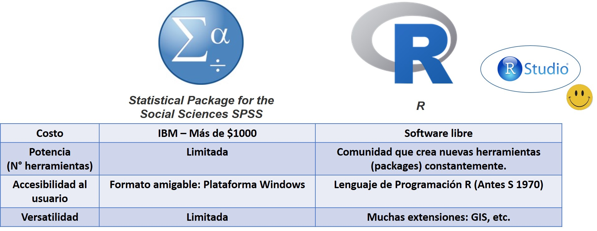

# R, un software libre

En esta primera parte vamos a aprender los principales elementos para entender el funcionamiento del R y del R Studio.  

## Aspectos básicos

En este video vamos a comentar las principales características del R y qué diferencias podemos identificar con otros paquetes estadísticos como el SPSS. Así también, veremos cómo es el procedimiento para la instalación del R y del R Studio.

<iframe width="560" height="315" src="https://www.youtube.com/embed/jLFfC899ZAU" frameborder="0" allow="accelerometer; autoplay; encrypted-media; gyroscope; picture-in-picture" allowfullscreen></iframe>

En resumen podríamos hacer una comparación entre el R y el SPSS para ver sus principales característicass. 

## Guía de instalación

Como hemos comentado, primero debemos instalar el R (el software estadístico), el cual lo podemos descargar en el siguiente enlace:

https://cran.r-project.org/bin/windows/base/

Posteriormente, debemos descargar el R Studio. RStudio es una interfaz, un entorno de desarrollo integrado (IDE) para el lenguaje de programación R, dedicado a la computación estadística y gráficos. Incluye una consola, editor de sintaxis que apoya la ejecución de código, así como herramientas para el trazado, la depuración y la gestión del espacio de trabajo. En otras palabras, es una interfaz que nos facilita la utilización del R y que viene con una serie de elementos para agilizar la programación.

Se puede descargar en el siguiente enlace (seleccionar opción “Open Source Licence”):

https://rstudio.com/products/rstudio/download/

**El orden es importante. Primero se debe instalar el R y luego el R Studio**.

