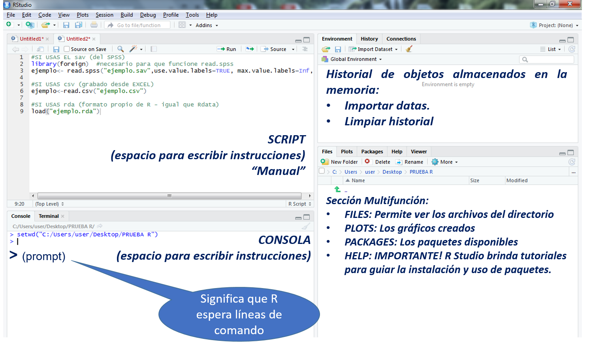
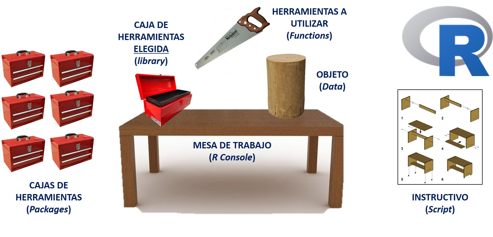
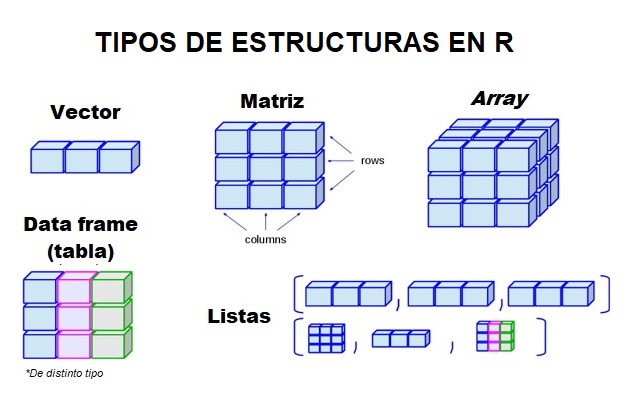

# R, un lenguaje de programación

## Entorno de programación

Vamos a comprender por qué es necesario saber un lenguaje de programación para aprender estadística en la ciencias sociales, así como cuál es la lógica que está detrás de las líneas de código.

Te sugiero ver el siguiente video:

<iframe width="560" height="315" src="https://www.youtube.com/embed/HpXiSLVyYrM" frameborder="0" allow="accelerometer; autoplay; encrypted-media; gyroscope; picture-in-picture" allowfullscreen></iframe>


Para iniciar el uso del R Studio debemos conocer cuáles son sus principales partes (o paneles clave) y cuál es la función de cada una de estas. Dentro de los elementos claves que debemos identificar en el R Studio se encuentran los siguientes:



### Consola

Siguiendo nuestra analogía, lo podemos recordar como **nuestra mesa de trabajo**. La consola viene a ser la parte principal de la interfaz. Es la zona donde ingresamos el código y también donde aparecen los resultados de las órdenes que le damos al programa. 

De esta manera, cuando solicitemos, por ejemplo, la media de una variable el resultado nos aparecerá en la consola. 





### Manuales del programador


Los **manuales de instrucciones** son archivos de texto en los cuales podemos escribir todos los códigos que deseemos aplicar a un conjunto de objetos. 

La ventaja clave de este tipo de manuales radica en que es un archivo que podemos guardar (con extensión .R) para poder ejecutar los códigos en otro momento. Así también, sirven para que nosotros podamos compartir los procedimientos que hemos seguido para desarrollar una investigación con el fin de que puedan ser replicados (o ejecutados) por otros investigadores. 

Cuando abrimos un manual nos aparece en el cuadrante superior izquierdo de nuestra interfaz del R Studio. 

Los más conocidos son: Script, R Markdown y R Notebook.


### Paquetes


Ya tenemos la mesa de trabajo (consola) y el manual (script), ahora necesitamos ubicar las **cajas de herramientas** según lo que deseamos hacer. Los paquetes (también llamados bibliotecas) son colecciones de funciones, generalmente agrupadas para una tarea específico. Podríamos seguir con la analogía, imaginemos que tenemos una caja de herramientas para trabajos eléctricos, otra para carpintería, etc. En el caso del análisis estadístico, podemos tener un paquete que contiene funciones para análisis exploratorio de datos, análisis geoespacial, bioestadística, modelamiento de datos, deeplearning, entre otros temas. 

Cuando nosotros instalamos el R Studio este viene con un conjunto de paquete preinstalados. Esto quiere decir que ya tenemos un grupo de funciones (las más comunes) que podemos solicitar directamente. Sin embargo, a medida que avancemos en el uso del R, nos vamos a dar cuenta que esos paquetes preinstalados no van a ser suficientes. 

Una vez que sabemos qué queremos hacer, debemos instalar los paquetes más adecuados. Para ello, utilizamos la siguiente función:

    install.packages("nombre_del_paquete")

Luego de solicitar la instalación nos aparecerán algunos mensajes en la consola y tenemos que asegurarnos que diga que "el paquete se ha instalado exitosamente".

### Funciones


El paso siguiente, una vez ubicada nuestra consola (mesa de trabajo), nuestro script (manual de instrucciones) y el paquete a utilizar (caja de herramientas) , debemos seleccionar la función que necesitemos (la herramienta más idónea). 

Una función es un conjunto de operaciones sistematizadas que el programa ejecuta sobre ciertos argumentos u objetos. 

Para utilizar una función es necesario primero abrir un paquete (al igual que si queremos una herramienta necesitamos abrir primero la caja de herramientas donde se encuentra). 

Para realizar dicha tarea debemos usar la siguiente función:

    library(nombre_del_paquete)

Esta función lo que hace es abrir el paquete que ya está instalado y dejar a disposición del usuario todas las funciones que se encuentran en el mismo. Luego de ello, ya podemos solicitar la función. Por ejemplo, si queremos realizar un histograma de la variable ingresos debemos escribir:

    hist(ingresos)

En la línea de comando anterior `hist` es el nombre de la función que se aplica sobre la variable `ingresos`.

Es importante mencionar que en el R el usuario también puede crear sus propias funciones para, por ejemplo, solicitar un conjunto de acciones al programa de forma fácil y con un simple comando. Sin embargo, este punto será desarrollado más adelante. 

### Objetos


El R es un lenguaje de programación que está orientado a objetos. Esto quiere decir que el programa utiliza las funciones, anteriormente explicadas, sobre elementos que guarda en la memoria activa del computador con un *nombre* específico. De esta manera, el usuario del programa puede manipular, alterar, modificar estos objetos utilizando operadores o funciones. Podemos ver estos objetos como la madera sobre la cual vamos a aplicar las herramientas que ya tenemos a la mano. 

En nuestro caso el objeto más usual que utilizaremos será los de tipo  `data.frame` o también conocidas como bases de datos. A partir de los cuales podemos seleccionar otros objetos como variables y, a su vez, crear nuevos objetos como tablas, gráficos, modelos, entre otros. 

Todos los objetos que tenemos disponibles en nuestra sesión de R Studio aparecen en nuestra sección de *Environment*, en el cuadrante superior derecho. Si no aparece ningún objeto eso quiere decir que tenemos que crearlos o, en todo caso, cargarlos al programa. 


------------------------------

## Código en R

Te recomiendo ver el siguiente tutorial:

<iframe width="560" height="315" src="https://www.youtube.com/embed/y7JPGlw6dJg" frameborder="0" allow="accelerometer; autoplay; encrypted-media; gyroscope; picture-in-picture" allowfullscreen></iframe>

### Script

Ya habíamos comentado en la sección anterior que el Script es una parte muy importante de la interfaz del R Studio y que nos va a ayudar mucho durante nuestro trabajo. 

El Script, el cual es un archivo con extensión .R, es un documento de texto que tiene la peculiaridad que puede ser leídos por el programa como un manual de código. De esa forma, nosotros podemos colocar en el script los códigos de nuestro análisis, ordenarlos, comentarlos y reproducirlos en el R Studio automáticamente. 

En suma, podemos redactar nuestros script, compartirlos con otros investigadores y ejecutarlos. 

Cuando abrimos un Script en el R Studio nos aparece una ventana en la parte superior izquierda de nuestra interfaz. Ahí nosotros podemos comenzar a redactar, como cualquier documento de texto, nuestros códigos. Sin embargo, nosotros podemos agregar información en el Script de dos formas específicas:

1. Como comentario: Cuando nosotros colocamos el símbolo # al iniciar una oración, el Script lo va a identificar como un comentario del programador, como un texto que no va a ser ejecutado como código. Esto es importante porque nos permite ir comentando, por ejemplo, lo que estamos redactando en el documento. Ej: "Este código sirve para abrir un archivo", "Aquí estoy haciendo un análisis de regresión", entre otros. 

2. Como código: Cuando escribimos directamente en el documento el programa lo va a entender como código o funciones. Esto es importante tenerlo en cuenta para evitar notificaciones de Error. 

En resumen: para agregar un comentario ponemos antes el símbolo "#" y para agregar una función escribimos directamente.


### R Markdown

El **R Markdown** es una sintaxis de formato simple que nos permite elaborar informes de manera rápida y sencilla. Los principales tipos de documentos que podemos elaborar con esta sintaxis son PDF, HTML (para verlo desde un navegador web), Word, entre muchos más. 

Algunas pecualiaridades del documento:

**Incluir texto**: A diferencia del script (en el cual teníamos que decirle al programa qué líneas son comentarios), en el R Markdown podemos redactar directamente sin ningún problema. El R Studio lo va a detectar como texto que forma parte del informe. 

**Incluir códigos**: Ahora bien, para incluir código debemos crear los denominados **chunks**. Estos son *trozos* de código que vamos a agregar a lo largo del texto y que tendrán la particularidad de que serán ejecutados por el programa cuando produzcamos el informe. Por ejemplo, si en nuestro informe queremos incluir el gráfico de la base *cars* debemos redactar lo siguiente:

  ```{r}
  plot(cars)
  ```

Para facilitarnos las cosas, el programa nos da una opción, que se encuentra en la parte superior derecha del documento Markdown, que dice **Insert**. Cuando queramos agregar un código de R, simplemente damos click al botón y elegimos "R". 

Una vez terminemos nuestro informe podemos visualizarlo dando click en el botón **Knit**. Nos daremos cuenta que el programa abrirá un documento HTML (si eso hemos elegido) en una ventana diferente.

Una particularidad de los R Markdown es que al momento de presionar Knit, este corre TODOS los códigos del documento. 

En general, una forma de verlo es la siguiente: si el Script era un documento de códigos en el cual podíamos agregar textos (usando el #), el R Markdown es un documento/informe de texto en el cual podemos agregar códigos (con los **chunks**). 

### R Notebook

El R Notebook es una variante del R Markdown que se ha introducido recientemente al programa. Tiene las mismas características de un R Markdown en relación al ingreso de información: el texto se ingresa directamente y se tienen que colocar **chunks** para ingresas *trozos* de código. 

Sin embargo, tiene algunas diferencias que lo hacen peculiarmente interesante a diferencia del R Markdown:

- Lo primero es que nos permite ejecutar los códigos **dentro** del mismo documento. Para ello, simplemente ponemos el botón de **Run** que se encuentra en la parte superior derecha (como si fuera un script).

- Cuando guardamos el R Notebook automáticamente se crea un archivo HTML (en nuestro directorio de trabajo) que contiene el código. Sin embargo, **incluirá sólo las salidas (outputs) que han sido ejecutadas (*Run*) en el documento**. 

- Nos permite visualizar una *Vista Previa* con el botón **Preview**. Podemos seleccionar verla en una ventana aparte o dentro del panel visualizador (**Viewer**) dentro de la interfaz del R Studio. 


## Clases de objetos en R

El R es un **lenguaje de programación orientado a objetos**, por ello, es necesario saber con qué clases de objetos podemos encontrarnos. 

Los objetos más básicos en R son los siguientes:

- character: Ej: "rojo".
- numeric: Ej: 1.5
- integer: Números enteros. Ej: 1L
- logical: Ej: TRUE o FALSE
- complex: Números complejos. Ej: 1+2i 

Ahora bien, uno puede crear **distintas estructuras**, las cuales se pueden formar combinando estos elementos básicos. 

Por ejemplo, la estructura más conocida es el **vector**, el cual es un conjunto de objetos de la misma clase (como si fuese una fila de objetos): sólo caracteres, sólo numéricos, sólo lógicos, etc.  



Para los fines de este libro se contemplarán las siguientes estructuras de datos:

| Tipo de vector | Descripción |
| ------------- | ------------- |
| Vector de factores  | Vector que sirve para representar variables categóricas. Pudiendo ser factores nominales u ordinales. Ej: "costa", "sierra", "selva"  |
| Vectores numéricos | Vector conformado por la concatenación de números. Ej: 1.5 , 2.7 , 3.1 |
| Matrices  | Son hojas de datos homogéneos, es decir, de un sólo tipo. Tiene columnas y filas |
| Data frames  | Son hojas de datos, estructuras similares a una matriz; sin embargo, a diferencia de estas pueden almacenar objetos de distintos tipo. **Generalmente nuestras bases de datos son de este tipo** (como una hoja de Excel que tiene variables numéricas, categóricas, etc).  |
| Listas | Conjunto de objetos de distinta clase. Ej: "rojo", "1", "lápiz". Algunas veces las vamos a utilizar a la hora de hacer nuestros cálculos. Tener en cuenta.  |


**Recuerda: la clase de un objeto determinará de qué modo será tratado por el programa. El programa está dirigido a objetos y las funciones que están dentro de él también.**


### Identificando el tipo de objeto

Nosotros podemos identificar la clase de objetos que tenemos mediante la función `class()`:

Creamos un vector numérico:

    x= c(1, 2, 3)
    x
    ## [1] 1 2 3
    class(x)
    ## [1] "numeric"

Creamos un vector character:

    y=c("gato", "perro", "loro")
    y
    ## [1] "gato"  "perro" "loro"
    class(y)
    ## [1] "character"

Solicitamos que nos muestre el tipo de objeto que es nuestra base de datos de *trabajadores*:

    head(trabajadores)

    ##   id sexo    fechnac educ catlab salario_actual salario_inicial antiguedad
    ## 1  1    1 1952-02-03   15      3          57000           27000         98
    ## 2  2    1 1958-05-23   16      1          40200           18750         98
    ## 3  3    0 1929-07-26   12      1          21450           12000         98
    ## 4  4    0 1947-04-15    8      1          21900           13200         98
    ## 5  5    1 1955-02-09   15      1          45000           21000         98
    ## 6  6    1 1958-08-22   15      1          32100           13500         98
    ##   experiencia minoría directivo
    ## 1         144       0         1
    ## 2          36       0         0
    ## 3         381       0         0
    ## 4         190       0         0
    ## 5         138       0         0
    ## 6          67       0         0

    class(trabajadores)
    ## [1] "data.frame"

De esta manera, le hemos preguntado al programa qué tipo de objeto es *trabajadores* y nos ha respondido que es un **data.frame**.

### Características de los objetos

Cada objeto tiene un conjunto de características particulares. 

Por ejemplo, como ya tenemos nuestra base de datos cargada (trabajadores), podemos aplicar un conjunto de funciones para profundizar en sus características. 

Hay muchas formas de conocer la estructura de esta data, sin embargo, sugiero seguir siempre los siguientes pasos:

- Número de columnas y filas tiene nuestra base de datos

Utilizamos la función `dim` para ver las dimensiones del archivo:

    dim(ejemplo)
    ## [1] 474  11

El primer número indica las filas (o número de casos) y el segundo el número de columnas (o variables).

- Contenido de la base de datos

Para ello utilizamos la función `names` y entre paréntesis ponemos el nombre de nuestra data:

    names(trabajadores)

    ##  [1] "id"              "sexo"            "fechnac"         "educ"           
    ##  [5] "catlab"          "salario_actual"  "salario_inicial" "antiguedad"     
    ##  [9] "experiencia"     "minoría"         "directivo"

De esta manera, nos damos cuenta que la base de datos "trabajadores" tiene 11 variables.

### Acceder a las partes de un objeto

Como hemos mencionado líneas arriba, hay ocasiones en que un objeto está compuesto por varios elementos a los cuales nosotros también podemos tener acceso. 

Creemos el siguiente objeto:

    x= c(4, 7, 9)
    x
    ## [1] 4 7 9

Ahora solicitemos sólo un elemento de este vector. Ej: solicitemos el segundo componente, para ello hacemos uso de los corchetes []

    x[2]

    ## [1] 7

Otra forma de acceder a una parte de un objeto es haciendo uso del símbolo $. Esto va a ser muy útil cuando nos refiramos a, por ejemplo, una variable en específico dentro de una base datos. 

Por ejemplo, el siguiente código solicita la clase del objeto *trabajadores*, que es nuestra base de datos:

    class(trabajadores)
    ## [1] "data.frame"

Pero si colocamos el símbolo $ luego del nombre de la base y especificamos el nombre de una variable (como salario_inicial) entonces: 

    class(trabajadores$salario_actual)

    ## [1] "numeric"

Ahora el programa entiende que lo que estamos solicitando es la clase de la variable salario_actual (que se encuentra en la base de datos "trabajadores"). Por ello nos dice que esta variable es de tipo numérico. 

**Recuerda: los símbolos más usuales para ingresar a las partes de un objeto son el $ y los [].** 


### Sugerencias

Para un detalle mayor sobre los objetos en el R revisa este sitio:

Seong, Tim (2018) *Working with R Data Objects* Sitio web de RPubs. [Link](https://rpubs.com/tskam/R4DSA-Hands-on_Ex01)

También puedes explorar con las siguientes palabras clave:

- Objects in R
- Data structure in R
- Data types in R

