# Conseguir la data

## Directorio de trabajo

Para comenzar el trabajo con el R Studio lo primero que debemos hacer es decirle al programa cuál es la ubicación de nuestra carpeta de trabajo (*working directory*). 

El *working directory* es el lugar en nuestra computadora (local) en el que están los archivos que vamos a utilizar durante nuestra sesión de trabajo. De la misma manera, es el lugar donde se encontrarán todos los documentos u objetos que vamos a producir en nuestro análisis (tablas, gráficos, bases de datos, entre otros). 

Antes de realizar cualquier análisis debemos seleccionar la carpeta que será nuestro directorio de trabajo, con el fin de mantener un orden durante toda la jornada. 

Para saber cuál es el directorio en el cual me encuentro trabajando sólo necesitamos redactar el siguiente comando.

    getwd()

Una vez aplicado dicha función, el R Studio nos dirá la ubicación en la cual está nuestra carpeta. Por ejemplo: "D:/Mis Documentos/R 

### Nuevo directorio

Para ello tenemos dos opciones. 

La primera implica redactar un código, en el cual le decimos al programa la nueva dirección de nuestro directorio de trabajo. 

    setwd("D:/Mis Documentos/Trabajos finales/examen parcial")

La segunda opción es más sencilla. Esta consiste en el uso de la propia interfaz del R Studio. 

Debemos ir a Session > Set Working Directory > Choose Directory

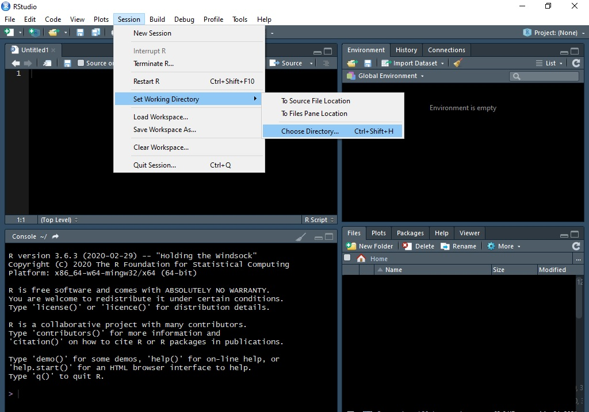

Luego de ello, seleccionamos la carpeta de nuestra preferencia y colocamos "Abrir"

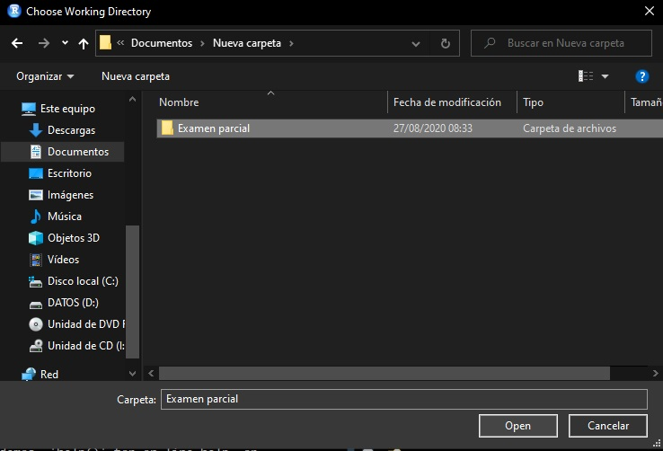

## GitHub y R

Como mencionamos en el apartado anterior, lo primero que debemos hacer antes de iniciar nuestra sesión es seleccionar nuestro *directorio de trabajo*. Cuando hacemos eso, todos los archivos que utilizamos o produzcamos se van a alojar en un lugar en nuestra computadora. 

Una limitante de ello es que, obviamente, si nos quedamos en ese paso, siempre debemos estar en nuestra computadora para utilizar nuestros archivos. 

Por ello, una estrategia utilizada por muchos usuarios del R Studio, así como de otros lenguajes de programación, es utilizar la plataforma GitHub para poder trabajar con sus archivos desde la nube (desde el almacenamiento virtual de la propia plataforma).

Seguramente en más de una ocasión hemos utilizado algunos programas de almacenamiento de datos en la nube como Google Drive o Dropbox. Lo que hacíamos era elegir nuestros archivos, guardarnos en nuestra cuenta de Google o Dropbox y, de esa manera, podíamos acceder a nuestros archivos desde cualquier computadora con acceso a internet. 

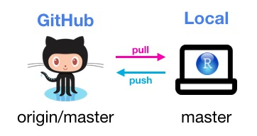

De la misma manera que el Google Drive o el Dropbox, el GitHub (creado el 2008) puede servir como un lugar de almacenamiento donde nosotros podemos guardar los documentos que vamos a utilizar en nuestra análisis: bases de datos, scripts, objetos producidos (tablas, gráficos), etc. 

Sin embargo, la característica más fundamental del GitHub no es sólo su capacidad de almacenamiento, sino que es un espacio específicamente diseñado para desarrolladores de software. De esta manera, uno puede **alojar** su proyecto en el sitio web y puede gestionar diversas versiones utilizando **el sistema de control de version GIT**. 

En otras palabas, el GitHub sirve para que un programador pueda subir el código en el que está trabajando, alojarlo en la nube y permitir el trabajo colaborativo con otros programadores. Para ello, se deben crear **repositorios**, los cuales son compartimientos específicos donde se colocan los archivos de un proyecto determinado. 

Ejemplo: Imagina que te encuentras desarrollando un script para el examen final, pero deseas trabajarlo colaborativamente. Para ello, creas un repositorio, subes el código en el que estás trabajando (script) y le das acceso a los miembros de tu grupo para que puedan editar el documento. El primer día tu puedes editar el documento, es la versión 1. En el segundo día, tu compañero hace un añadido, es la versión 2, así sucesivamente. El GitHub te permite colaborar en proyectos conjuntos y tener un historial de todas las versiones de un mismo proyecto de programación (como en este caso el script de tu análisis estadístico).

En este libro vamos a explorar cómo utilizar el GitHub a través del Github Desktop.

### Instalar el programa GIT

Como se había mencionado, el GitHub se basa en el GIT, el cual es un software para controlar versiones. Por ello, antes de seguir con el GitHub debemos instalar este software en nuestra computadora. 

Para ello, entramos al siguiente enlace:

https://git-scm.com/downloads

Y luego, seleccionamos la opción más adecuada para nosotros según nuestro sistema operativo (Windows, Mac o Linux)

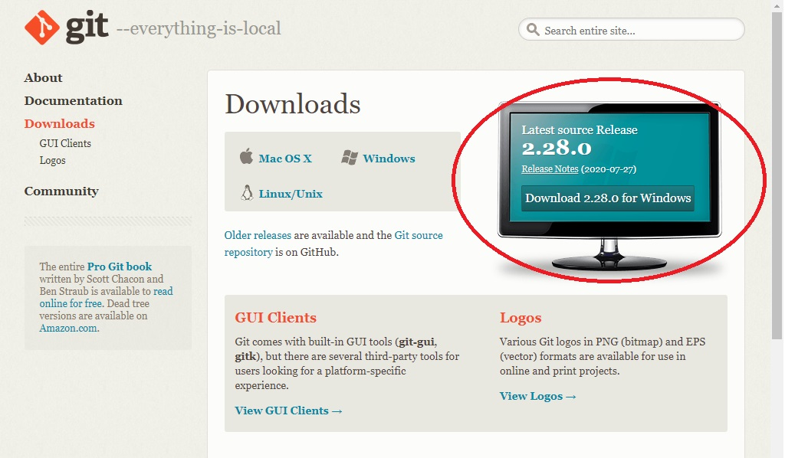

Una vez instalado podemos seguir con los siguientes pasos. 

### Crear una cuenta en GitHub

Para crear tu cuenta en GitHub es necesario entrar a: www.github.com 

Selecciones un nombre de usuario, un correo electrónico a asociar y una contraseña. Una vez te suscribas a la página ya tendrás un usuario donde podrás alojar tus repositorios. 

### Crear repositorio

Para ello simplemente damos click a "New":

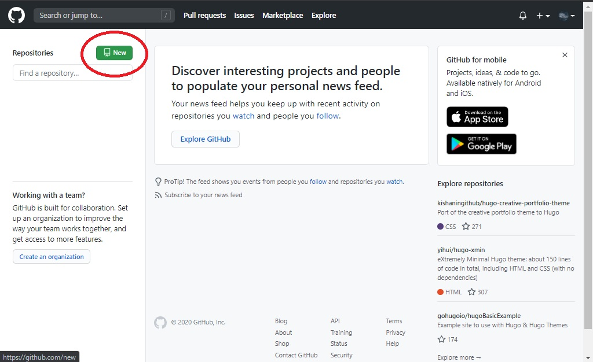

Detallamos cuál será el nombre de nuestro repositorio (en este caso "mi_repositorio") y damos click a "Crear Repositorio":

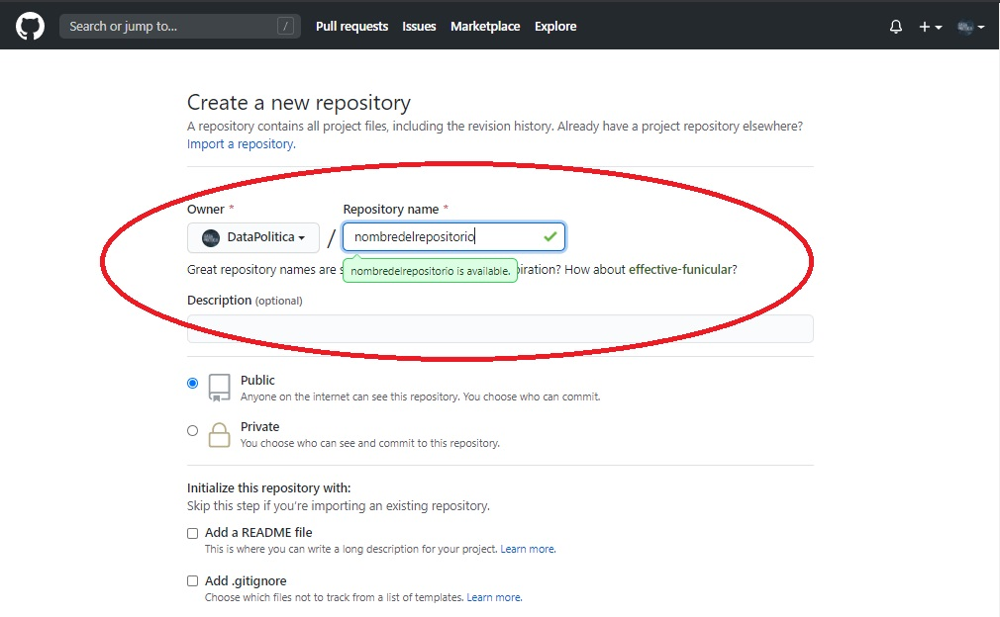

Listo, ya tenemos la cuenta y nuestro repositorio creado. 

### Instalar GitHub Desktop

Una vez que tengamos nuestra cuenta de GitHub y ya tengamos nuestro repositorio creado, viene el siguiente paso: agregar archivos y enlazar nuestro proyecto de R con la plataforma GitHub para almacenarlo en la nube y permitir el control de versiones. 

En otras palabras, deseo que mi carpeta de trabajo (*working directory*) esté enlazada con el GitHub. 

Para ello, a fin de hacer más sencillo el trabajo, sugiero instalar el software GitHub Desktop. Este es un programa para enviar/solicitar cambios en nuestros repositorios de forma más fácil y sencilla. 

Lo podemos descargar en:

https://desktop.github.com/

Seleccionamos la opción más adecuada según nuestro SO y lo instalamos:

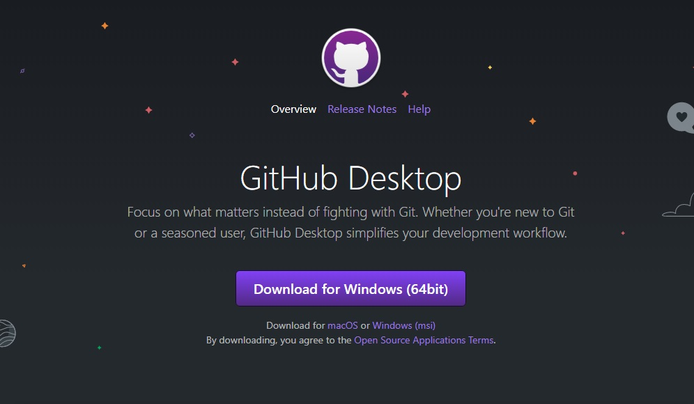

Una vez esté instalado, abrimos el programa, ingresamos nuestro usuario y contraseña y ya estará enlazado con nuestra cuenta de GitHub en la nube. Esto quiere decir que nosotros podemos "descargar nuestros archivos" de nuestra cuenta y también "enviar nuevas versiones" de los mismos. 

### Clonar un repositorio (de la nube) en mi disco local

Seleccionamos "Clone Repository"

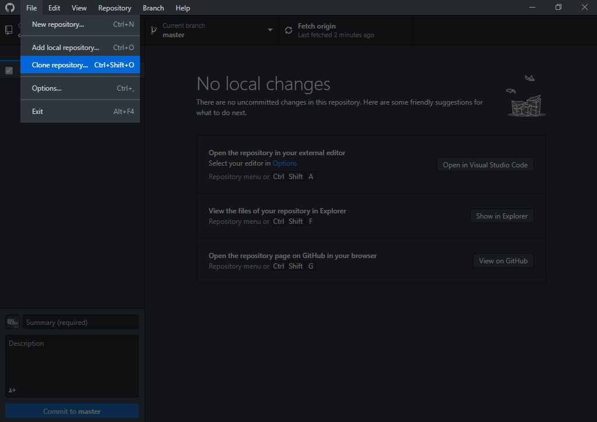

Como ya está enlazado con nuestro usuario, el programa nos va a solicitar que elijamos un repositorio de nuestra cuenta. También nos va a pedir que seleccionamos la ubicación que tendrá ese repositorio (carpeta) en nuestra computadora. 

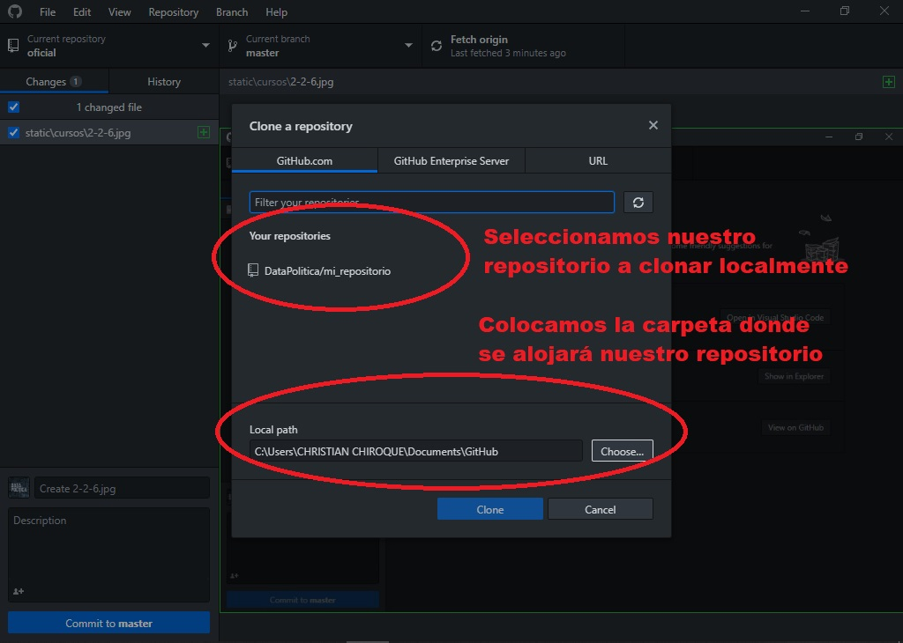

Una vez terminemos estos pasos nos daremos cuenta que en la ubicación que hemos seleccionado se creó una carpeta con el mismo nombre que nuesro repositorio.

### Agregar cambios a la nube (PUSH)

Bien, ahora comencemos a utilizar el GitHub. Por ejemplo, entremos a R Studio y seleccionemos que el *Directorio de trabajo* sea la carpeta de nuestro repositorio (ver sección anterior). 

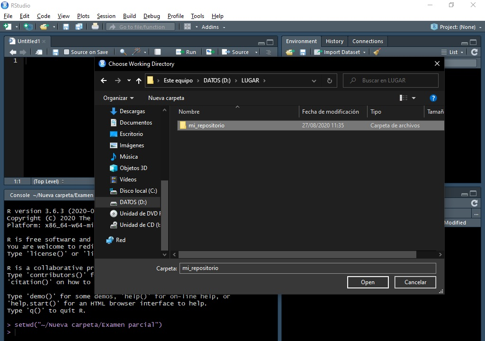

Creemos un Script para ver cómo funciona. Hemos creado un script en nuestra carpeta local que está linkeada a nuestro repositorio. 

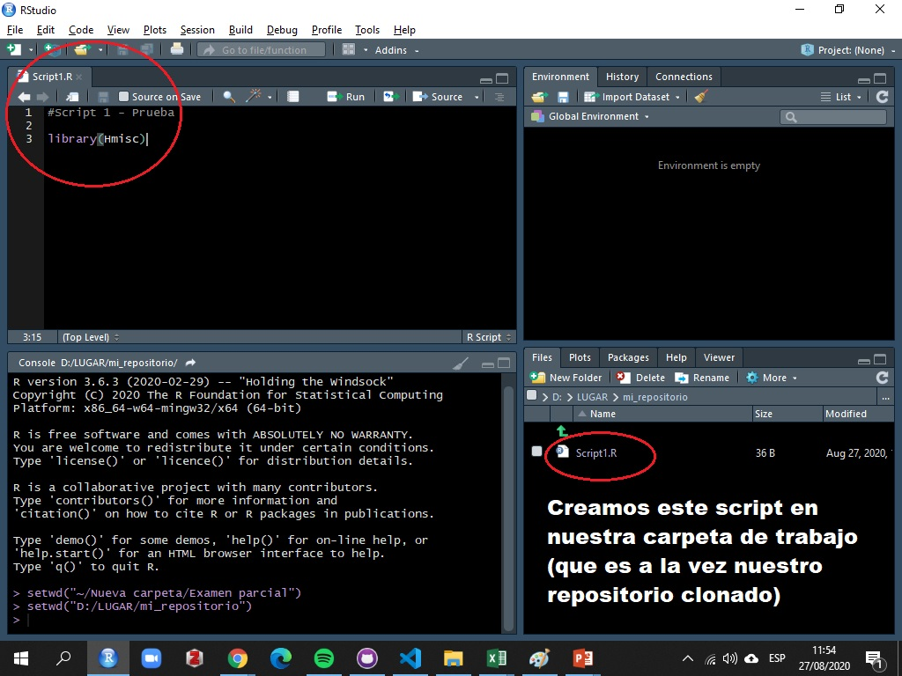

Una vez hecho el cambio (creación de Script) nos vamos al GitHub Desktop. 

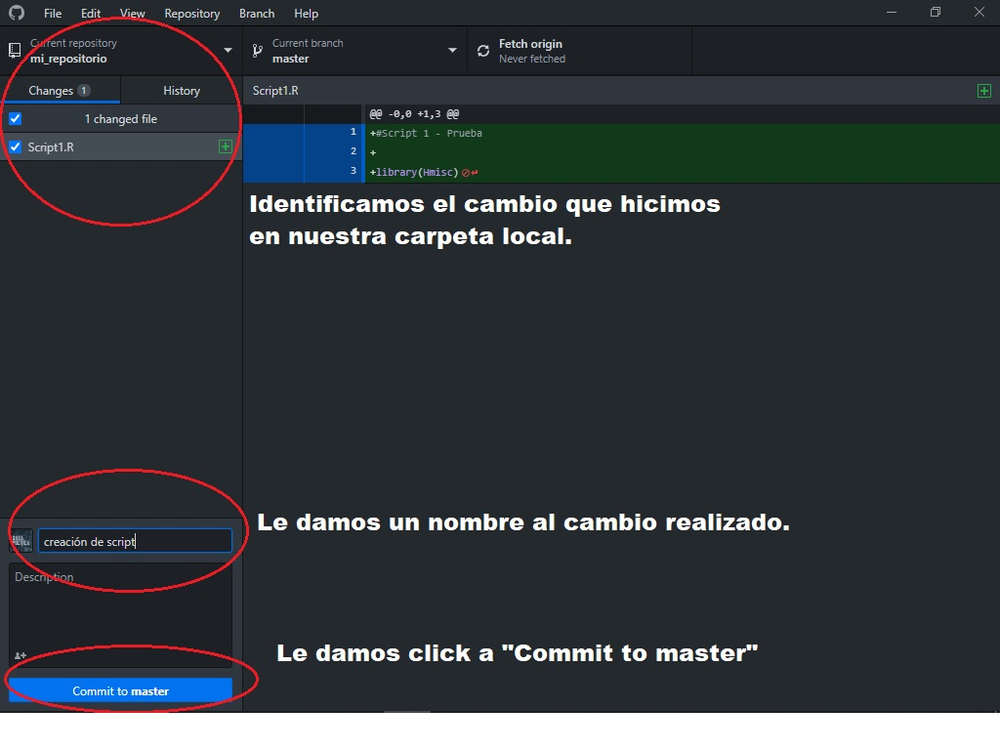

**Recuerda que debes asegurarte que has guardado los cambios en cada archivo que has editado localmente.**

Lo que debemos ver en el GitHub Desktop es que en la parte izquierda figuran la lista de todos los cambios realizados (en este caso dice que agregamos un archivo que se llama Script1). En el panel derecho nos aparece el detalle de ese cambio (es decir el contenido en este caso).

A continuación, le damos un nombre a ese cambio en la casilla que se encuentra en la parte inferior y seleccionamos Commit to Master.

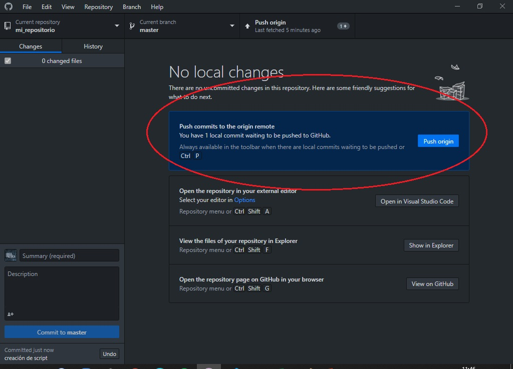

Finalmente para "enviar" esos cambios a nuestro repositorio le damos click a **Push**.

Luego de eso, si vamos al GitHub (nube) nos vamos a dar cuenta que nuestro cambio (creación del Script1) ya figura en nuestro repositorio. 

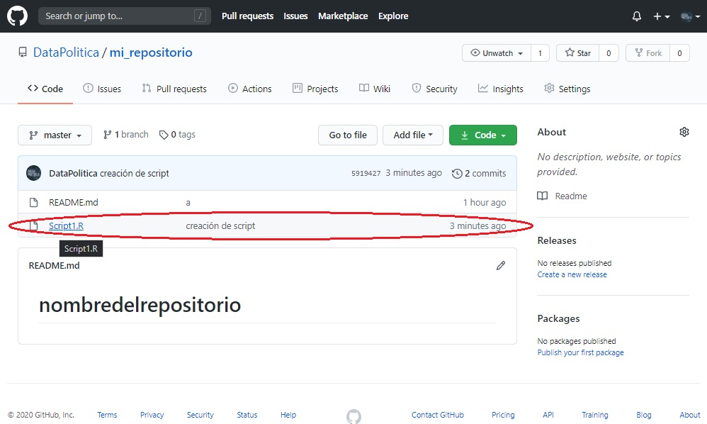

De la misma manera que hemos creado este script y lo hemos subido, podemos hacer lo mismo con bases de datos, gráficos, tablas o con cualquier otro tipo de documento. 

La lógica siempre será la misma: editar los documentos -> guardar los cambios localmente -> Ir al GitHub Desktop -> Verificar que los cambios realizados aparezcan en el panel -> Darle un nombre a ese cambio -> Poner Commit to Master -> Colocar **Push**

### Descargar cambios desde la nube (PULL)

Si es que alguien ha realizado algún cambio a tu proyecto en la nube es fácilmente de descargar esos cambios localmente. 

Cuando abras tu GitHub Desktop vas a la parte superior que dice "Fetch origin".

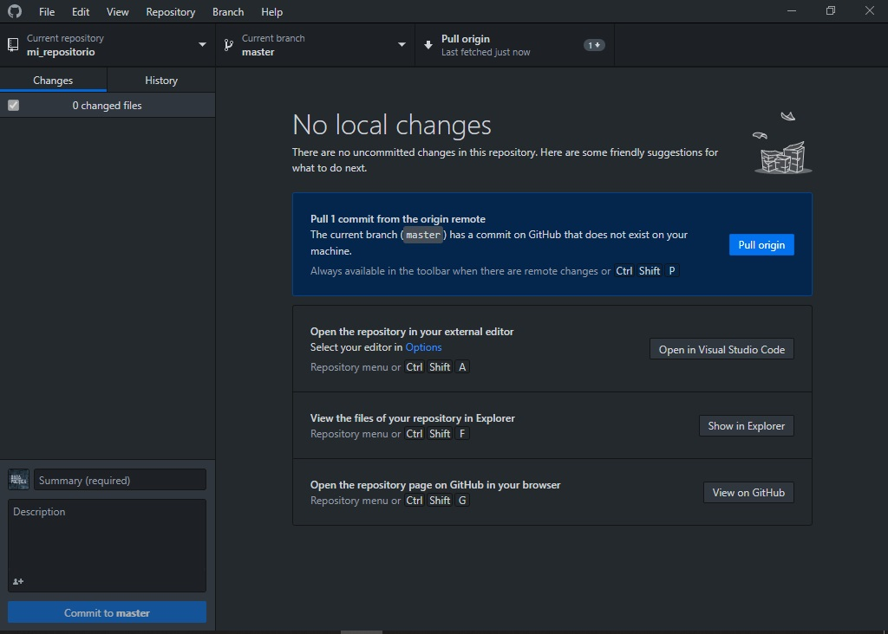

Luego, si es que existe algún cambio realizado, vas a ver que automáticamente te sale la opción de "Pull origin". Cuando presionas esa opción todos los cambios hechos en la nube se descargarán localmente. 

**Recuerda siempre llevar un orden en tus ediciones de tal manera que no se genere conflictos en los documentos editados. Edita localmente, guarda cambios localmente, presiona Push origin. Edita en la nube, guarda los cambios en la nube, presiona Fetch Origin, presiona Pull origin.** 

### Sugerencias

Puedes buscar mayor información con las siguientes palabras clave:

- How to connect GitHub with R
- GitHub in R Studio
- How works GitHub Desktop

## Manipular bases de datos

Lo primero que tenemos que tener en claro en el proceso de manejo de bases de datos son tres cosas:

- Importar: Traer una base de datos de la nube o de nuestra computadora (local) hacia nuestro entorno de trabajo.
- Convertir: Cambiar el formato de una base de datos que tenemos en nuestro entorno de trabajo.
- Exportar: Guardar una base de datos que hemos trabajado como un nuevo archivo. 

Para ello, vamos a hacer uso del paquete `rio`, el cual es un conjunto de funciones que nos permiten realizar estas tres operaciones de una manera sencilla y rápida. Lo importante de este paquete a comparación de otros es que optimiza el proceso de importación/exportación de datos requiriendo una menor cantidad de código que otros paquetes. 

Puedes leer más sobre el paquete `rio` haciendo click a [este enlace](https://www.rdocumentation.org/packages/rio/versions/0.5.16).

Para utilizar este paquete debemos instalarlo y luego abrirlo.

    install.packages("rio")
    library(rio)

### Importar localmente

Una vez ya tengamos nuestro directorio de trabajo establecido, lo siguiente es abrir una base de datos. Imaginemos que en nuestro directorio de trabajo tenemos una base llamada trabajadores.sav

Lo que queremos hacer es abrir la data en el R. Para ello, lo único que tenemos que hacer es utilizar la función `import`:

    data=import("trabajadores.sav")

Lo que le estamos diciendo al programa es que importe la data *trabajadores.sav* y que le de el nombre de *data*.

**Recuerda que para escribirlo de esa manera el archivo(base de datos) ya debe encontrarse en tu carpeta de trabajo. Si lo tienes en alguna otra parte de tu computadora puedes escribir el enlace, como por ejemplo: C:/Mis documentos/Clase R/trabajadores.sav.**

### Importar desde la nube (GITHUB)

En el apartado anterior habíamos revisado las ventajas de trabajar con repositorios en la nube. Por ello, también podemos importar datos a nuestro entorno de trabajo que no se encuentren en nuestro disco duro local sino alojado en una plataforma en la nube (como GitHub).

Lo primero que tenemos que hacer es conseguir el link de la data. Para ello, debemos ir al repositorio donde está alojada la data, darle click al archivo que deseamos utilizamos y luego ubicar el botón que dice "Descargar". 

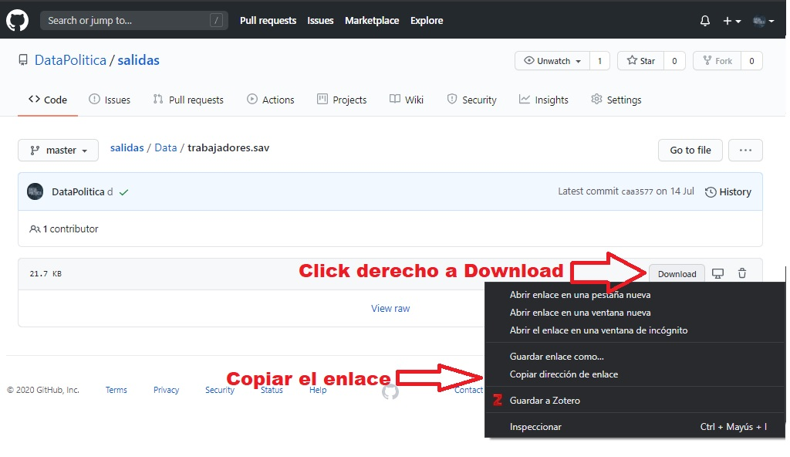

Nosotros no vamos a presionar este botón (porque lo que haríamos sería descargar el archivo en nuestra computadora), sino que le vamos a dar click derecho y vamos a presionar "copiar dirección de enlace". En el ejemplo de la imagen el enlace que copiamos es:

**https://github.com/DataPolitica/salidas/raw/master/Data/trabajadores.sav**

Luego de ello, ya en nuestro R, vamos a crear un objeto que se llame *link* y que sea equivalente a esa dirección. 

    link="https://github.com/DataPolitica/salidas/raw/master/Data/trabajadores.sav"

Luego, utilizaremos la función `import` para traer la data de la nube y le llamaremos *trabajadores*.

    trabajadores=import(link)

Finalmente, podemos ver que en nuestro apartado de objetos (cuadrante superior derecho) ya figura la data que hemos importado desde la nube:

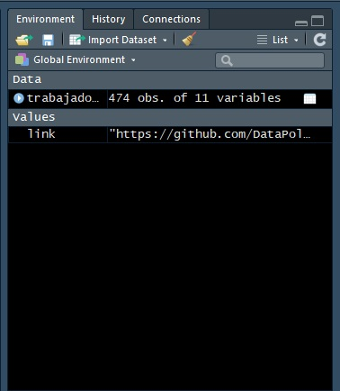

### Convertir archivos

Hasta este punto quizás los tipos de bases de datos más comunes que hemos visto son de formato Excel (.xls), SPSS (.sav) o los del propio R (.rda). Sin embargo, es muy probable que, a medida que avancemos en el uso del software, nos topemos con archivos de otros formatos. 

Hay un conjunto muy largo de *extensiones*, cada una de estas asociada a un programa en específico. Lo bueno del paquete `rio` es que nos permite convertir un archivo de un formato a otro de forma muy rápida. 

Por ejemplo, si tengo la base de datos de *trabajadores.sav* en mi carpeta de trabajo y deseo convertirla a formato .rda, sólo tengo que escribir el siguiente comando:

    convert("trabajadores.sav", "trabajadores.rda")

Cuando veamos nuestra carpeta vamos a ver que se ha creado una nueva versión de la base de datos pero con la extensión que le hemos indicado. 

Para más detalle sobre extensiones y programas asociados [ver aquí](https://cran.r-project.org/web/packages/rio/vignettes/rio.html#supported_file_formats).

### Exportar archivos

Finalmente, siguiendo la línea de lo comentado líneas arriba, para exportar un archivo que tengamos en nuestra sesión sólo debemos escribir la siguiente línea de comando: 

    export(trabajadores, "trabajadores.csv")

Lo que le estamos diciendo al programa es que guarde la base de datos *trabajadores* (que viene a ser la data que tenemos abierta en nuestra sesión) como un archivo llamado *trabajadores.csv*. Si no deseamos exportar un archivo a .csv podemos indicarle el formato que queremos colcando la extensión respectiva. 

### Palabras clave

- How to import files in R
- Export and import packages
- Get my data in R

## Web scrapping

### Introducción

Como sabemos, en el R Studio nosotros trabajamos sobre objetos. Pues bien, algunas veces nosotros podemos tener nuestros objetos (bases de datos, usualmente) de archivos que nos entregan directamente; sin embargo, otras veces la información se encuentra en diversas páginas web dentro del internet. 

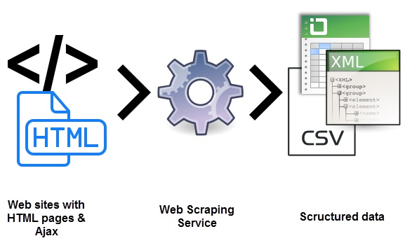

El **Web Sraping** es una técnica para conseguir información de forma rápida y sistematizada por medio de algoritmos de búsquedas. Para el caso del R Studio, es necesario utilizar paquetes construidos específicamente para web scraping. En otras palabras, estos paquetes lo que hacen es entrar a una página web, extraen cierta información que le indiquemos y lo cargan a nuestra sesión de R Studio

**Algunos puntos a tener en cuenta**

Para hacer Web Scraping es necesario tener algunas consideraciones previas si es que antes no hemos explorado el contenido de una página web. 

- De antemano sabemos que existen distintos tipos de páginas web, algunos parecen una hoja con letras (como si fuese una hoja de Word), pero muchas contienen ciertos elementos: videos, tablas, cuadros, imágenes, enlaces, entre otros. Entrar al mundo de cómo se construyen las páginas web es un objetivo que escapa a este apartado. Sin embargo, será necesario recordar que detrás de lo que vemos siempre existen un conjunto de códigos, denominado código fuente, que han servido para construir la página web. 

- Sabiendo el código de ciertos elementos, como es el caso de las tablas, nosotros podemos decirle al R Studio que nos **extraiga** cierta información a nuestro entorno de trabajo. 

- Para ello, necesitamos el paquete "htmltab" el cual sirve para poder extraer tablas de diversos tipos de páginas web construidas en lenguaje html. 

- Es necesario anotar que existen muchos paquetes diseñados para web scraping. Otro paquete conocido es el paquete Rvest, cuyo contenido también te recomiendo revisar en [este enlace](https://cran.r-project.org/web/packages/rvest/rvest.pdf).

### Paso a paso

#### Identificar nuestra página web y la tabla que queremos descargar

Primero tenemos que identificar nuestra página. En este caso entraremos a la página web de [Wikipedia titulada *Departamentos del Perú por IDH*](https://es.wikipedia.org/wiki/Anexo:Departamentos_del_Per%C3%BA_por_IDH). 

En esta página web figura una tabla con los departamentos del Perú y los resultados que han obtenido en las distintas mediciones del Índice de Desarrollo Humano. 

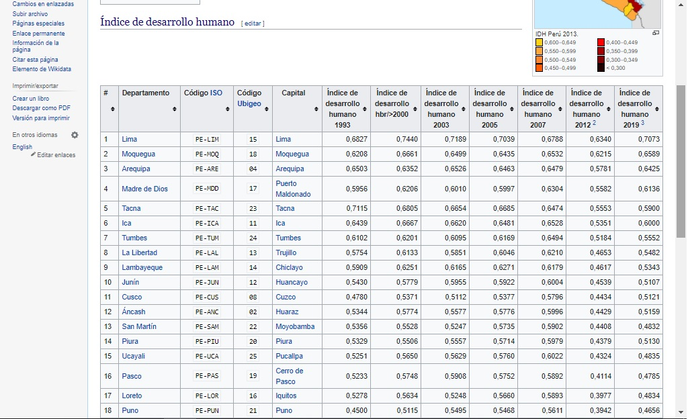

Listo, tenemos ya identificada nuestra página web y el *objeto* que queremos extraer (tabla de resultados de IDH según departamento en el Perú)

#### Inspeccionar la página web y encontrar el *código* de la tabla

Para ello tenemos que darle click derecho a nuestra tabla y seleccionar la opción **inspeccionar**.

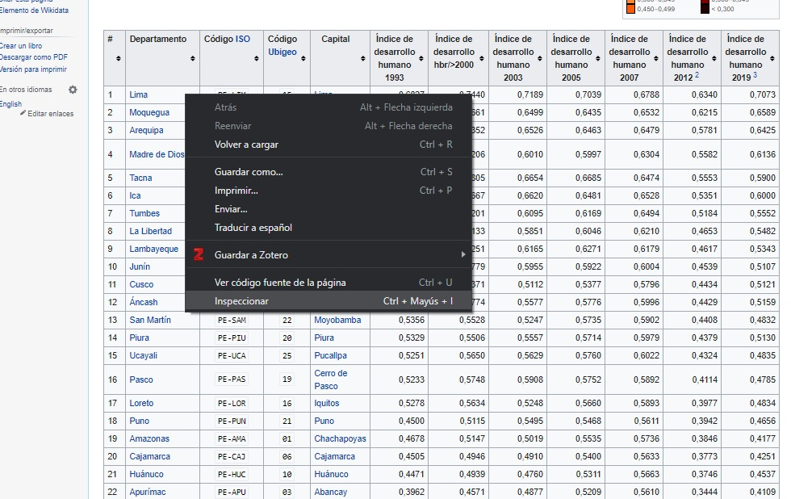

Vamos a ver que nos sale una subventana en la parte derecha que tiene muchos códigos. Tranquilos, estos códigos son la **infraestructura** de la página web. Cada letra y objeto que vemos en la vista normal tiene un código detrás con el cual ha sido programado. Literalmente estamos viendo la Matrix. 

Pues bien, luego de poner click derecho sobre nuestra tabla vamos ubicando el cursos en las líneas superiores hasta que veamos que la tabla se sombree por completo.

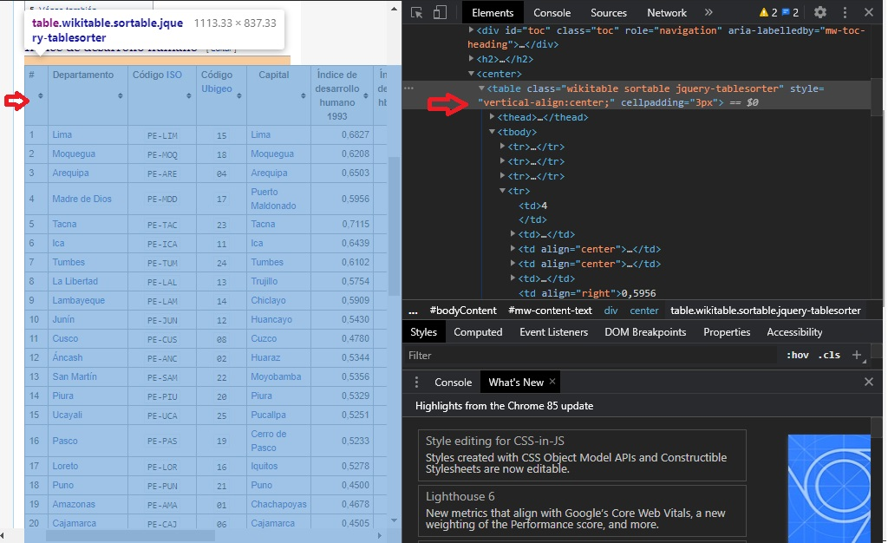

Luego de eso, damos click derecho sobre ese código, seleccionamos *Copy* y *Copy Xpath*.

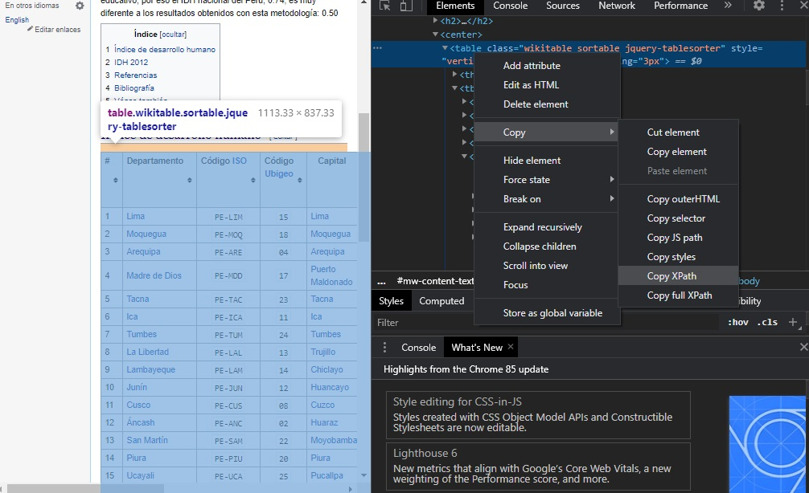

El *Xpath* es como si fuese una ubicación del objeto que queremos extraer dentro de toda la infraestructura html de la página web.

Vemos que en este caso lo que copiamos es lo siguiente: 

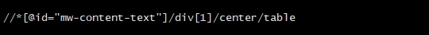

#### Utilizar el paquete *htmltab*

Una vez identificado la dirección de la página web y el *Xpath* del elemento que queremos descargar, ya podemos utilizar el paquete *htmltab*. Abrimos el paquete:

    library(htmltab)

Creamos dos objetos. Primero un objeto que sea el link de la página web y otro objeto que sea el código Xpath.

    link_de_pagina= "https://es.wikipedia.org/wiki/Anexo:Departamentos_del_Per%C3%BA_por_IDH"
    codigoXPATH ='//*[@id="mw-content-text"]/div[1]/center/table'

**Cuidado: Si observas bien, en un caso hemos usado las "" y en otro ''. Debes recordar que en el caso del Xpath vamos a utilizar las comillas simples. Estas se pueden incluir presionando ALT + 39.**

Luego, aplicamos la función htmltab en la cual le indicamos, en primer lugar, la dirección de la página (doc = link_de_página) y la ubicación del objeto que queremos extraer (which =codigoXPATH). A la base de datos extraída le daremos el nombre de data_IDH

    data_IDH = htmltab(doc = link_de_pagina, which =codigoXPATH)

Para finalizar vemos que en la parte superior derecha de nuestro entorno de trabajo ya figura un objeto que es nuestra base de datos extraída. Para corroborar los elementos (variables) de nuestra base de datos utilizamos la función names:

    names(data_IDH)

    ##  [1] "#"                                    
    ##  [2] "Departamento"                         
    ##  [3] "Código ISO"                         
    ##  [4] "Código Ubigeo"                       
    ##  [5] "Capital"                              
    ##  [6] "Ã\215ndice de desarrollo humano 1993"    
    ##  [7] "Ã\215ndice de desarrollo hbr/>2000"      
    ##  [8] "Ã\215ndice de desarrollo humano 2003"    
    ##  [9] "Ã\215ndice de desarrollo humano 2005"    
    ## [10] "Ã\215ndice de desarrollo humano 2007"    
    ## [11] "Ã\215ndice de desarrollo humano 2012 â\200‹"
    ## [12] "Ã\215ndice de desarrollo humano 2019 â\200‹"

También le podemos aplicar el comando str() para ver la estructura de nuestro data.frame:

    str(data_IDH)

    ## 'data.frame':    24 obs. of  12 variables:
    ##  $ #                                    : chr  "1" "2" "3" "4" ...
    ##  $ Departamento                         : chr  "Lima" "Moquegua" "Arequipa" "Madre de Dios" ...
    ##  $ Código ISO                         : chr  "PE-LIM" "PE-MOQ" "PE-ARE" "PE-MDD" ...
    ##  $ Código Ubigeo                       : chr  "15" "18" "04" "17" ...
    ##  $ Capital                              : chr  "Lima" "Moquegua" "Arequipa" "Puerto Maldonado" ...
    ##  $ Índice de desarrollo humano 1993    : chr  "0,6827" "0,6208" "0,6503" "0,5956" ...
    ##  $ Índice de desarrollo hbr/>2000      : chr  "0,7440" "0,6661" "0,6352" "0,6206" ...
    ##  $ Índice de desarrollo humano 2003    : chr  "0,7189" "0,6499" "0,6526" "0,6010" ...
    ##  $ Índice de desarrollo humano 2005    : chr  "0,7039" "0,6435" "0,6463" "0,5997" ...
    ##  $ Índice de desarrollo humano 2007    : chr  "0,6788" "0,6532" "0,6479" "0,6304" ...
    ##  $ Índice de desarrollo humano 2012 ​: chr  "0,6340" "0,6215" "0,5781" "0,5582" ...
    ##  $ Índice de desarrollo humano 2019 ​: chr  "0,7073" "0,6589" "0,6425" "0,6136" ...

Ya tenemos nuestra data de IDH como un objeto en nuestro R Studio. 

