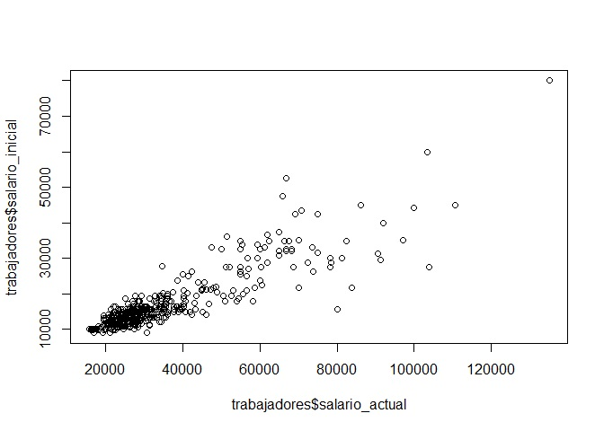

# Análisis exploratorio de datos

Como sabemos, los estadísticos de tendencia central van a depender del
tipo de variable que estemos analizando.

Para practicar este apartado vamos a utilizar la base de datos de Lapop
del año 2017. [Lapop](https://www.vanderbilt.edu/lapop-espanol/) es el
Proyecto de Opinión Pública de América Latina implementado por la
Universidad de Vanderbilt, el cual es un proyecto de investigación
multinacional especializado en el desarrollo, implementación y análisis
de encuestas de opinión pública.

Abrimos la base de datos desde nuestro repositorio:

    library(rio)
    link="https://github.com/DataPolitica/salidas/raw/master/Data/sub_lapop.sav"
    lapop=import(link)

Esta base de datos ha sido editada con fines didácticos (idioma,
recodificación, etc).

## Para nominales 

### Preparación

Selecciones la variable *urbanorural* y procedemos a configurarla
adecuadamente.

Primero identifiquemos cómo el R está leyendo la variable.

    str(lapop$urbanorural)

    ##  num [1:2153] 2 2 2 2 2 2 2 2 2 2 ...
    ##  - attr(*, "label")= chr "Urbano / Rural"
    ##  - attr(*, "format.spss")= chr "F8.2"
    ##  - attr(*, "display_width")= int 9
    ##  - attr(*, "labels")= Named num [1:2] 1 2
    ##   ..- attr(*, "names")= chr [1:2] "Urbano" "Rural"

    class(lapop$urbanorural)

    ## [1] "numeric"

Luego, al ver que aún se encuentra como *numérico*, entonces lo
convertimos en factor:

    lapop$urbanorural=as.factor(lapop$urbanorural)
    class(lapop$urbanorural)

    ## [1] "factor"

Verificamos los niveles y, de acuerdo con la metadata, le asignamos las
etiquetas a cada uno de los mismos.

    levels(lapop$urbanorural)

    ## [1] "1" "2"

    levels(lapop$urbanorural)<-c("Urbano","Rural")
    levels(lapop$urbanorural)

    ## [1] "Urbano" "Rural"

Asimismo, podemos solicitar una tabla que nos muestre las proporciones
por cada categoría. Para ello, utilizamos la función `prop.table()`.
Cuando escribimos esta función hay que tener en cuenta que la tenemos
que aplicar *sobre* la tabla de frecuencias normal (que aplicamos
anteriormente):

    prop.table(table(lapop$urbanorural))

    ## 
    ##    Urbano     Rural 
    ## 0.6149559 0.3850441

Si queremos los porcentaje hacemos lo mismo pero al final le decimos que
lo multiple por 100 (*100):

    prop.table(table(lapop$urbanorural))*100

    ## 
    ##   Urbano    Rural 
    ## 61.49559 38.50441

Ya tenemos la variable lista para aplicar técnicas de análisis
descriptivo.

### Estadísticos descriptivos

Lo primero que podemos hacer es solicitar la función `summary`. Esta
función nos va a dar una mirada rápida al contenido de nuestra variable.
En el caso de ser factor, nos va a mostrar las frecuencias (incluye los
NA si los hubiera):

    summary(lapop$urbanorural)

    ## Urbano  Rural 
    ##   1324    829

Como sabemos el estadístico más idóneo para variables nominales es la
moda. Por ello, hacemos uso del paquete `DescTools` y de la función
`Mode()`:

    library(DescTools)
    Mode(lapop$urbanorural)

    ## [1] Urbano
    ## attr(,"freq")
    ## [1] 1324
    ## Levels: Urbano Rural

Lo que nos dice el resultado es que la moda es la categoría *Urbano* y
nos indica la frecuencia.

Otra opción también es solicitar una tabla simple para ver la frecuencia
de cada categoría.

    table (lapop$urbanorural)

    ## 
    ## Urbano  Rural 
    ##   1324    829

### Gráficos

Lo primero que podemos solicitar es un diagrama de pie o de sectores.
Nótese que primero debemos crear un objeto que sea la tabla de la
variable que deseamos graficar, en este caso, de urbano rural. De esa
manera, el programa podrá utilizar los datos y plasmarlos en un gráfico.

    mi_tabla <- table(lapop$urbanorural)
    pie(mi_tabla)

**Es recomendable graficar un máximo de 7 sectores. Si colocamos una varaible con más sector puede resultar confusa la interpretación.**

También podemos solicitar un diagrama de barras.

    barplot(mi_tabla)

**Agregando más detalles a nuestros gráficos**

Hasta este momento hemos visto que podemos solicitar gráficos de una
forma muy práctica. Sin embargo, nosotros podemos solicitar un producto
más elaborado en la medida en que agreguemos más características al
código.

Por ejemplo, si deseamos un diagrama de barras azul escribimos:

    barplot(mi_tabla, col="blue")

Si deseamos un diagrama de barras azul y con título escribimos:

    barplot(mi_tabla,col="blue", 
            main="Casos según su lugar de procedencia")

Como nos damos cuenta, nosotros podemos ir agregando más características
a nuestro código. Es posible que recuerdes ejemplos de códigos de
programación que son líneas interminables. Eso es así porque los
programadores elaboran productos muy específicos y que, en su mayoría de
veces, requieren la especificación de muchas características.

Nuestro objetivo será avanzar en el uso de estos códigos de programación
para poder, al igual que los programadores, elaborar análisis
estadísticas cada vez más complejos y específicos.

## Para ordinales

Abrimos la base de datos LAPOP desde nuestro repositorio:

    library(rio)
    link="https://github.com/DataPolitica/salidas/raw/master/Data/sub_lapop.sav"
    lapop=import(link)

### Preparación

Esta vez vamos a utilizar la variable **Interés en la política**.
Procedemos a configurarla adecuadamente.

Primero identifiquemos cómo el R está leyendo la variable.

    str(lapop$interes)

    ##  num [1:2153] 2 2 1 1 1 2 2 2 2 3 ...
    ##  - attr(*, "label")= chr "Interés en la política"
    ##  - attr(*, "format.spss")= chr "F8.2"
    ##  - attr(*, "display_width")= int 11
    ##  - attr(*, "labels")= Named num [1:4] 1 2 3 4
    ##   ..- attr(*, "names")= chr [1:4] "Nada" "Un poco" "Algo" "Mucho"

    class(lapop$interes)

    ## [1] "numeric"

Luego, al ver que aún se encuentra como *numérico*, entonces lo
convertimos en factor ordenado:

    lapop$interes=ordered(lapop$interes)
    class(lapop$interes)

    ## [1] "ordered" "factor"

Verificamos los niveles y, de acuerdo con la metadata, le asignamos las
etiquetas a cada uno de los mismos. En este caso los significados son:
1, "Nada"; 2, "Poco"; 3, "Algo"; y 4, "Mucho".

    levels(lapop$interes)

    ## [1] "1" "2" "3" "4"

    levels(lapop$interes)<-c("Nada","Poco", "Algo", "Mucho")
    levels(lapop$interes)

    ## [1] "Nada"  "Poco"  "Algo"  "Mucho"

Ya tenemos la variable lista para aplicar técnicas de análisis
descriptivo para ordinales.

### Estadísticos descriptivos

Al igual que la sección anterior, podemos solicitar la función
`summary()` para que nos muestre las frecuencias por cada categoría (en
este caso tampoco tenemos NA´´s):

    summary(lapop$interes)

    ##  Nada  Poco  Algo Mucho 
    ##   632   787   532   202

Utilizando el paquete `DescTools` podemos solicitar la moda, con la
función `Mode()`; y la mediana, con la función `Median()`:

    library(DescTools)
    Mode(lapop$interes)

    ## [1] Poco
    ## attr(,"freq")
    ## [1] 787
    ## Levels: Nada < Poco < Algo < Mucho

    Median(lapop$interes)

    ## [1] Poco
    ## Levels: Nada < Poco < Algo < Mucho

Lo que nos dice el resultado es que la moda es la categoría *Poco*. La
mediana nos dice que, si ordenamos los resultados de menor a mayor, el
valor central es *Poco*. También podemos interpretarlo como que "al
menos el 50% de los casos tienen poco interés en la política".

Otra opción, al igual que las nominales, es solicitar una tabla simple
para ver la frecuencia de cada categoría.

    table (lapop$interes)

    ## 
    ##  Nada  Poco  Algo Mucho 
    ##   632   787   532   202

### Gráficos

Primero creamos un objeto que sea la tabla de la variable que deseamos
graficar, en este caso, *interés por la política*.

    mi_tabla <- table(lapop$interes)
    mi_tabla

    ## 
    ##  Nada  Poco  Algo Mucho 
    ##   632   787   532   202

Solicitamos un diagrama de pie o sector con la función `pie()`:

    pie(mi_tabla)

Solicitamos un diagrama de barras con la función `barplor()`:

    barplot(mi_tabla)

## Para numéricas

### Preparación

Abrimos la base de datos LAPOP desde nuestro repositorio:

    library(rio)
    link="https://github.com/DataPolitica/salidas/raw/master/Data/sub_lapop.sav"
    lapop=import(link)

*Seleccionamos la variable ingresos*

### Estadísticos descriptivos

Solicitar la función `summary()` y vamos a ver que el resultado variable
significativamente de los resultados de las variables categóricas:

    summary(lapop$ingresos)

    ##    Min. 1st Qu.  Median    Mean 3rd Qu.    Max. 
    ##    1316    2661    3010    3012    3341    4667

Como vemos, el summary ahora nos muestra los principales estadísticos de
una variable numérica, es decir: mínimo, 1er cuartil, mediana, media o
promedio, 3er cuartil y máximo. Siempre que tengamos una variable
numérica comencemos por solicitar esta función.

### Estadísticos de dispersión

La lógica es la misma, colocamos la función y entre paréntesis el nombre
de la variable:

Si deseamos la desviación estándar utilizamos la función `sd()`:

    sd(lapop$ingresos)

    ## [1] 498.6063

Si deseamos la varianza utilizamos la función `var()`:

    var(lapop$ingresos)

    ## [1] 248608.3

También podemos pedir estadísticos de dispersión. 

Para solicitar la asimetría y curtosis primero abrimos el paquete
`e1071`:

    library(e1071)

Para la asimetría utilizamos la función `skewness()`:

    skewness(lapop$ingresos)

    ## [1] 0.0544436

Para la curtosis utilizamos la función `kurtosis()`:

    kurtosis(lapop$ingresos)

    ## [1] -0.0678835

### Gráficos

En este caso, como estamos ante una variable numérica, no necesitamos
crear una tabla antes de solicitar los gráficos.

-   Histograma

Solicitemos un histograma con la función `hist()`:

    hist(lapop$ingresos)

-   Diagrama de cajas o **boxplot**

Solicitemos un diagrama de cajas con la función `boxplot()`:

    boxplot(lapop$ingresos)

## Análisis bivariado

### Tablas de contingencia

Abrimos la base de datos LAPOP desde nuestro repositorio:

    library(rio)
    link="https://github.com/DataPolitica/salidas/raw/master/Data/sub_lapop.sav"
    lapop=import(link)

Verificamos y configuramos adecuadamente las variables que utilizaremos

    lapop$urbanorural=as.factor(lapop$urbanorural)
    levels(lapop$urbanorural)<-c("Urbano","Rural")
    lapop$sexo=as.factor(lapop$sexo)
    levels(lapop$sexo)<-c("Hombre","Mujer")

Una vez que hemos identificamos dos variables categóricas lo primeros
que podemos solicitar es una tabla de contingencia.

Ante de seguir te sugiero ver el siguiente tutorial para solicitar
tablas de contigencias:

<iframe width="560" height="315" src="https://www.youtube.com/embed/kzZGHLAdRAc" title="YouTube video player" frameborder="0" allow="accelerometer; autoplay; clipboard-write; encrypted-media; gyroscope; picture-in-picture" allowfullscreen></iframe>

Como vimos en el video, podemos pedir tablas de contingencia con la
función `table()`. Hagamos una tabla para las variables *urbanorural* y
*sexo*:

Primero hallemos una tabla de contingencia simple, con sólo las
frecuencias. La llamaremos *tabla1*:

    tabla1 <- table(lapop$urbanorural, lapop$sexo)
    tabla1

    ##         
    ##          Hombre Mujer
    ##   Urbano    687   637
    ##   Rural     434   395

Podemos agregarle los totales marginales escribiendo la siguiente
función `addmargins()`

    addmargins(tabla1)

    ##         
    ##          Hombre Mujer  Sum
    ##   Urbano    687   637 1324
    ##   Rural     434   395  829
    ##   Sum      1121  1032 2153

Ahora, pidamos una tabla de contingencia con porcentaje Tenemos que
hacer referencia a la tabla creada anteriormente y usar el comando
`prop.table()` y lo multiplicamos por 100. La llamaremos *tabla2*:

    tabla2 <- prop.table(tabla1)*100
    tabla2

    ##         
    ##            Hombre    Mujer
    ##   Urbano 31.90896 29.58662
    ##   Rural  20.15792 18.34649

Vemos que nos da los valores totales, pero nosotros queremos sólo los
porcentaje por columna. Para ello, debemos hacer referencia a las
columnas dentro del comando agregando el número 2 (si ponemos 1
aparecerán los porcentaje por filas)

    tabla3 <- prop.table(tabla1, 2)*100
    tabla3

    ##         
    ##            Hombre    Mujer
    ##   Urbano 61.28457 61.72481
    ##   Rural  38.71543 38.27519

Por último, podemos agregarle los totales marginales escribiendo la
siguiente función `addmargins()`

    addmargins(tabla3)

    ##         
    ##             Hombre     Mujer       Sum
    ##   Urbano  61.28457  61.72481 123.00937
    ##   Rural   38.71543  38.27519  76.99063
    ##   Sum    100.00000 100.00000 200.00000

### Una  numérica y una categórica

Para mostrar los descriptivos de una variable numérica según una
variable categórica tenemos que considerar a esta última como grupos. De
esta manera, lo que hacemos en realidad es la comparación de la numérica
entre 2 o más grupos.

Para ello, utilizamos el paquete `psych()`

    library(psych)

Para describir la varible podemos utilizar la función `describeBy()`.
Notemos que primero debemos poner la variable numérica y luego el grupo
de comparación.

Por ejemplo, obtengamos los estadísticos descriptivos de la variable
*Edad* según si la persona pertenece al ámbito rural o urbano
(categórica/grupos):

    describeBy(lapop$edad,group=lapop$urbanorural)

    ## 
    ##  Descriptive statistics by group 
    ## group: Urbano
    ##    vars    n  mean    sd median trimmed   mad min max range skew kurtosis  se
    ## X1    1 1324 37.79 14.59     35   36.51 14.83  18  86    68 0.67    -0.27 0.4
    ## ------------------------------------------------------------ 
    ## group: Rural
    ##    vars   n  mean    sd median trimmed   mad min max range skew kurtosis   se
    ## X1    1 829 36.96 13.68     35   35.84 14.83  18  80    62 0.63    -0.25 0.48

También podemos solicitar un diagrama de cajas o **boxplot** según los
grupos:

    boxplot(lapop$edad~lapop$urbanorural)

### Dos variables numéricas

Utilicemos la base de datos *trabajadores*:

    library(rio)
    base_trabajadores="https://github.com/DataPolitica/salidas/raw/master/Data/trabajadores.sav"
    trabajadores=import(base_trabajadores)

Para analizar la relación entre dos variables numéricas es muy común
referirse al gráfico de dispersión.

Para ello, solicitamos el gráfico con la función `plot()`. Entre
paréntesis colocar las dos variables numéricas: el salario inicial y el
salario actual de los trabajadores de una empresa.

    plot(trabajadores$salario_actual, trabajadores$salario_inicial)

Podemos especificar más elementos de nuestro gráfico de dispersión.
Agreguemos título del gráfico y etiquetas de los ejes X e Y:

    plot(trabajadores$salario_actual, trabajadores$salario_inicial, 
         main="Relación entre salario inicial y salario final", 
         xlab="Salario actual", 
         ylab="Salario final")

