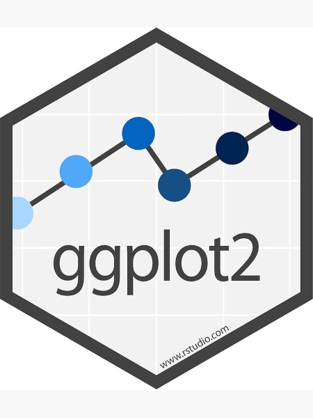
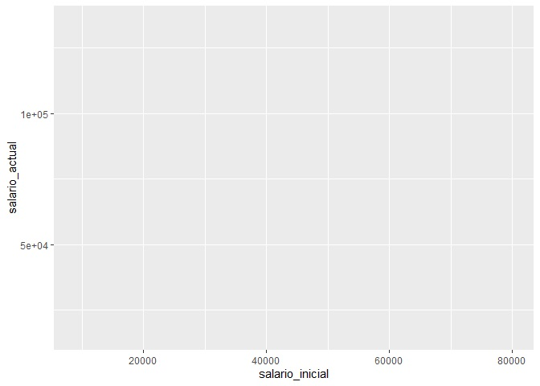
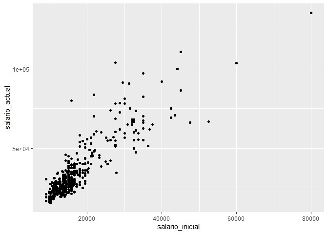

# Manipulación con Tidyverse

## Gráficos con ggplot2

### Introducción

Como hemos visto, hasta este momento, para realizar nuestros distintos
gráficos hemos utilizado los comandos que ya están preinstalados en el R
Studio (barplot(), hist(), pie(), entre otros). Sin embargo, una
limitante de estas `funciones` es que los gráficos son muy simples.

Por ello, es común la utilización de otros paquetes que, entre sus
funciones, contemplan herramientas para graficar variables de una forma
más completa y con mejor presentación. Uno de los paquetes más conocidos
por su potencia y también por su adaptabilidad es el **ggplot2**.

El **ggplot2** es un paquete de trazado que nos ayuda a simplificar la
creación de gráficos complejos. Las características del comando (a
diferencia de las funciones básicas de gráficos) nos permite agregar más
propiedades visuales. Lo clave de este paquete es que funciona de forma
aglomerativa, agregando elemento por elemento, por ello, analizaremos la
estructura del código.

### Estructura del código

Cuando veamos la función ggplot() tenemos que identificar los siguiente
elementos básicos:

1.  Base de datos (**data**)

Es la base de datos de donde obtenemos la información a graficar.

2.  Estéticas (**aes**)

Es una lista de asignaciones estéticas para utilizar en el gráfico. De
una forma sencilla, podríamos verlo como la sección que describe los
datos que serán graficados (variables), así como algunas características
principales (color, tamaño, entre otros).

3.  Capas (**geom**)

También denominadas capas geométricas. Una vez que tengamos la data
identificada y las asignaciones incluidas, agregamos las capas, las
cuales son las indicaciones directas de qué graficar.

Te darás cuenta que si no detallas este punto, te aparecerá un gráfico
en blanco.

Dentro de los tipos de capas más comunes para nuestros fines podemos
encontrar:

| Tipo de capa | comando a agregar |
| ------------- | ------------- |
| Dispersión | + geom_point()  |
| Líneas | + geom_line() |
| Histogramas  | + geom_histogram() |
| Barras  | + geom_bar() |
| Boxplot  | + geom_boxplot() |

Dependiente de lo que queremos graficar, deberemos agregar ese frase en
nuestro comando.

### Utilizando ggplot2 paso a paso

#### Conseguir la data y abrir el paquete

Conseguir la base de datos::

    library(rio)
    base_trabajadores="https://github.com/DataPolitica/salidas/raw/master/Data/trabajadores.sav"
    trabajadores=import(base_trabajadores)

Se debe instalar el paquete con la función
**install.packages("ggplot2")**. Luego, abrirmos el paquete a utilizar.

    library(ggplot2)

De la misma manera, como hemos comentado en secciones anterior, si
deseamos utilizar variables debemos verificar que estén siendo leídas de
forma adecuada (las númericas como vectores numéricos y las categóricas
como factores, se no ordenados u ordenados).

####  Utilizar la función ggplot() e indicarle la data

Vamos a ir construyendo el comando paso a paso con la finalidad de que
el lector pueda identificar cada componente de la función. Estas luego
serán escritas directamente y en un solo momento.

Primero le decimos al comando ggplot() qué data vamos a utilizar:

    ggplot(data = trabajadores)

Si corremos este comando sólo con esa informació nos mostrará una
sección en blanco puesto que debemos seguir detallando las parte
necesarias para construir el gráfico.

####  Decirle qué estéticas va a considerar

Como comentamos arriba, **las estéticas** son los componentes que serán
agregados en el gráfico. En otras palabras, los datos a graficar
(*mapping*).

En este caso, vamos a decirle que considere que el eje x del gráfico
represente *el salario inicial del trabajador* y el eje y *el salario
actual*:

    ggplot(trabajadores, mapping = aes(x=salario_inicial, y= salario_actual))

Hasta el momento vemos que ya aparecen los ejes x e y pero aún no nos
aparece ningún gráfico.

Ya detallamos la data, ya detallamos los ejes, ahora queda precisar qué
gráfico queremos.

####  Agregar capas

En este caso, al estar trabajando con dos numéricas podemos decirle al
comando que nos muestre un gráfico de dispersión. Entonces, tenemos que
agregar la capa necesaria, es decir: + geom\_point()

    ggplot(trabajadores, mapping = aes(x=salario_inicial, y= salario_actual)) + geom_point()

####  Guardar el gráfico

Una vez tengamos el gráfico terminado podemos guardarlo como un archivo
.png con el siguiente comando:

    ggsave("mi_grafico.jpg")

    ## Saving 7 x 5 in image

Luego de este comando verás que efectivamente se guardo la imagen con ese nombre en tu directorio de trabajo. 