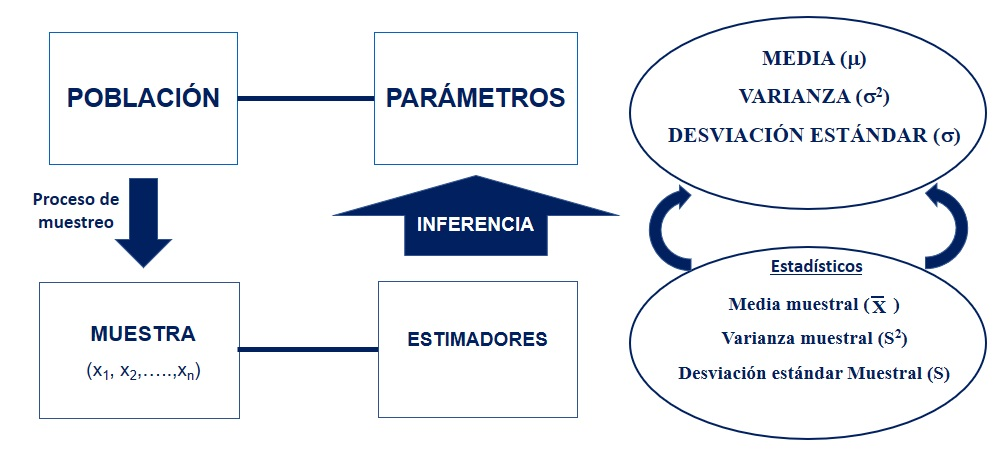
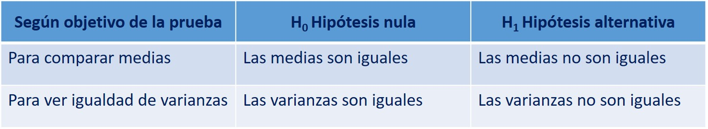
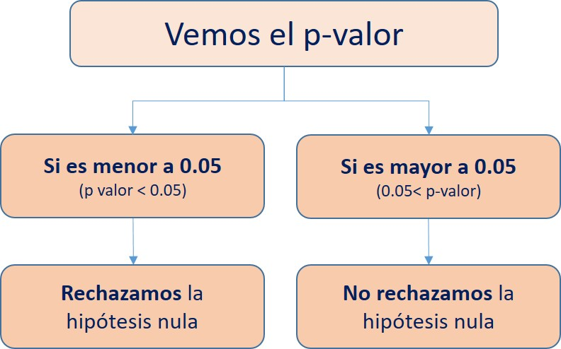

# Introducción a la estadística inferencial

## Conceptos basicos

Estos son los conceptos que veremos a lo largo del libro y que serán indispensables para comprender cada uno de los apartados:

- **Objetivo de la Estadística Inferencial**: Realizar un cálculo de los parámetros poblacionales a partir de data de una muestra representativa. 

- **Población**: Conjunto total de individuos u objetos que tienen el mismo conjunto de características (variables) y del cual queremos obtener información. 

- **Muestra**: Parte de la población, es obtenida a través de un determinado proceso de muestreo. El objetivo es que sea lo más representativa posible de la población de interés. 

- **Parámetro**: Una característica de la población. Ej: el promedio de la edad de todos los individuos de la población. 

- **Estadístico**: Una característica de la muestra. Ej: el promedio de la edad de todos los individuos de mi muestra. 

### Proceso de la estadística inferencial

La estadística implica el estudio de la población a través de una muestra. Esto quiere decir que con la información de un subconjunto de individuos/objetos (estadísticos) vamos a **inferir** las características de toda la población de individuos/objetos (parámetros). En otras palabras, con algunos datos podemos realizar generalizaciones, estimaciones y predicciones para conocer las características de una población en particular. 

Para realizar tal proceso nos valemos de un conjunto de técnicas y estrategias desarrolladas que utilizan cálculos de probabilidades para poder estimar los parámetros. 

**Recuerda que la muestra debe ser representativa. No es objetivo de este libro hacer un estudio sobre los métodos de muestreo; sin embargo, debes recordar que sólo el proceso de diseño muestral puede ser un trabajo largo y que requiere mucha rigurosidad. Muchos estudios estadísticos tienen el problema que llegan a conclusiones basados en muestras no representativas.**

### Métodos de estimación

Dentro de la estadística inferencial existen dos métodos de estimación del parámetro (característica de la población): el estimador puntual, la estimación por intervalo.

- **El estimador puntual** es cuando nosotros representamos nuestra estimación **utilizando un sólo número**. Por ejemplo: nosotros realizamos una encuesta para saber la aprobación presidencial en el país y obtenemos que un 60% de la muestra aprueba la gestión del presidente. A través de este número (60%) nosotros podríamos hacernos una idea del parámetro (si es que la muestra es representativa). 

Este tipo de estimadores son usados mayormente por los medios de comunicación para problematizar cierto tema; sin embargo, no es una información que nos ayude mucho al final de cuentas. 

- **Estimación por intervalo**: Es un método que no nos entrega un sólo número sino que nos indica un **intervalo** en el cual se podría encontrar el parámetro población. Este se calcula a partir del estimador puntual y se le agrega un *margen de error* Ej: siguiendo el ejemplo anterior, este método nos podría indicar que el porcentaje de personas que aprueban la gestión del presidente **en la población** se puede encontrar entre 56% y 64%.

### El rol de la computadoras y los software estadísticos

Como imaginarás, hace algunas décadas todos los cálculos necesarios para realizar análisis estadísticos se realizaban a mano, esto quiere decir que los estadísticos hacían cálculos y todos los procedimientos por ellos mismo utilizando lápiz y papel. 

Sin embargo, gracias al avance tecnológicos hoy día tenemos las computadoras y los software estadísticos (como el R, SPSS, Stata, entre otros) que hacen los cálculos complejos por nosotros y nos brindan los resultados en muy poco tiempo. 

Esto, si bien es muy útil y obviamente alivia de un trabajo complejo al investigador, también ha ocasionado que muchas personas utilicen el software de forma poco rigurosa, llegando a conclusiones que muchas veces no guardan relación con la teoría que está detrás del cálculo. 

Por ello, antes de entrar a uno de los temas a ver aquí serán importantes dos pasos:

1. Revisar adecuadamente la base teórica de los métodos de estadística inferencial a utilizar. Esto permitirá saber qué es lo que estamos haciendo y para qué. 

2. Revisar las funciones que utilizaremos: Estamos usando el R y en este programa, como comentamos anteriormente, hay muchas formas de llegar al mismo punto y hay muchos paquetes (y funciones) que nos permiten hacer lo mismo. Sin embargo, cada una de estas tienen ciertas particularidades que fueron diseñadas por sus creadores (recordemos que R es un software libre y las funciones son creadas por una comunidad de usuarios), por ello, es necesario saber bien qué hacen las funciones que aplicamos y cuáles son sus características. 

## Intervalos de confianza

Te recomiendo ver el siguiente tutorial para el cálculo de intervalos de confianza en el R Studio:

<iframe width="560" height="315" src="https://www.youtube.com/embed/WZimlAIzza0" frameborder="0" allow="accelerometer; autoplay; encrypted-media; gyroscope; picture-in-picture" allowfullscreen></iframe>

## Pruebas de hipótesis

Luego de los intervalos de confianza, las pruebas de hipótesis son los métodos más utilizados para realizar inferencia estadística. Estas pruebas se basan en el uso de las probabilidades para realizar sus cálculos. 

El objetivo final es verificar qué tan probable es que una **hipótesis** sobre la población sea cierta. . Resume evidencia para averiguar si una hipótesis es probable.

**Recuerda una hipótesis es una afirmación sobre la población. Usualmente presentado como la atribución de una característica al parámetro poblacional.** 

Las pruebas de hipótesis tienen 5 pasos bien definidos:

### Supuestos

Cada prueba de hipótesis tiene ciertas condiciones en las cuales se puede aplicar.

Uno de los supuestos principales requeridos es que el proceso de muestreo (recojo de información) haya sido realizado de forma aleatoria. 

El segundo supuesto más recurrente es que la variable a utilizar tenga distribución normal.  Gracias al teorema del límite central, con N grande (mayor a 121) podemos asumir normalidad

### Hipótesis

Cada prueba de medias tiene dos hipótesis sobre la población: la hipótesis nula y la hipótesis alternativa.

Nosotros vamos a poner a prueba la hipótesis nula (H0) mediante la recolección de evidencia en los datos encontrados en la muestra que anteriormente hemos recogido (o nos han entregado).

Algunos ejemplos de hipótesis según el objetivo de la prueba:

### Test estadístico

Son el instrumento para validar o rechazar las hipótesis. Ellos tratan de distinguir lo que es plausible de lo que es muy poco verosímil, en el marco de un objetivo dado.

Existen diversos test estadísticos dependiendo del objetivo del investigador: Pruebas T (comparación de media en dos grupos), Anova de un factor (comparación de medias en más de dos grupos), Chi cuadrado (asociación), entre los más resaltantes. 

### El p-valor (p-value)

Es una medición estadística que va de 0 a 1. Se usa para el contraste de hipótesis.

Si cumple con la condición de ser menor al nivel de significancia (alpha = 0.05 a un 95% de confianza) impuesto arbitrariamente, entonces la hipótesis nula será, eventualmente, rechazada.

El p-valor es un número que veremos en todos nuestros análisis a lo largo de este manual. Si bien la explicación de tal término está relacionada a un conjunto de elementos teóricos de estadística, puedes ver el siguiente video que te permitirá tener una idea general de para qué sirve este número. 

<iframe width="560" height="315" src="https://www.youtube.com/embed/ibmjzFv4K1Y" frameborder="0" allow="accelerometer; autoplay; encrypted-media; gyroscope; picture-in-picture" allowfullscreen></iframe>

### Conclusión

Hasta este punto hemos obtenido un conjunto de números en nuestros calculos. Ahora la parte más importante es la interpretación de esos números. 

Es muy usual que un estudiante realice todos los pasos anteriores de forma eficiente pero tenga problemas al momento de generar conclusiones. Como dijimos, la finalidad de la estadística inferencial es establecer conclusiones sobre la población, por ello, estas deben ser presentadas de forma clara y rigurosa. 

Para ello, debemos seguir el siguiente flujograma:

Una vez que sabemos el valor de significancia (p-valor) y si rechazamos o no rechazamos la hipótesis nula, vamos a redactar nuestra conclusión. Para ello es necesario incorporar los siguiente elementos en el fraseo: nombre de la prueba, resultado del p valor, si rechazamos o no rechazamos la hipótesis nula, y la idea o conclusión final. 

Ejemplo: Estamos ante una Prueba T de comparación de medias de la variable *Ingreso* en hombres y mujeres, cuya hipótesis nula es que "Las medias son iguales en los dos grupos analizados" y el p-valor que obtuvimos es 0.03. Con estos insumos redactamos:

Luego de realizar la **Prueba T** y de acuerdo al **p-valor obtenido (0.03)**, podemos **rechazar** la hipótesis nula de que **las medias de la variable Ingreso son iguales en los dos grupos analizados (hombres y mujeres)** y concluir que **las medias son diferentes** en ambos grupos poblacionales. 

