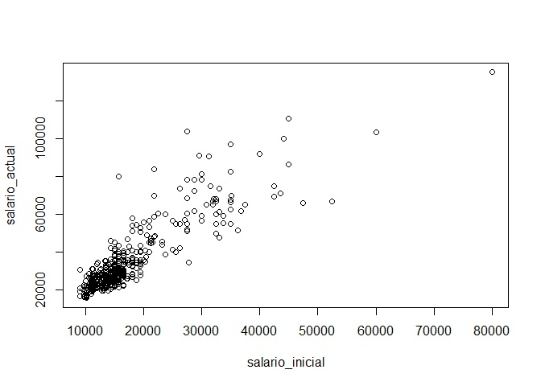
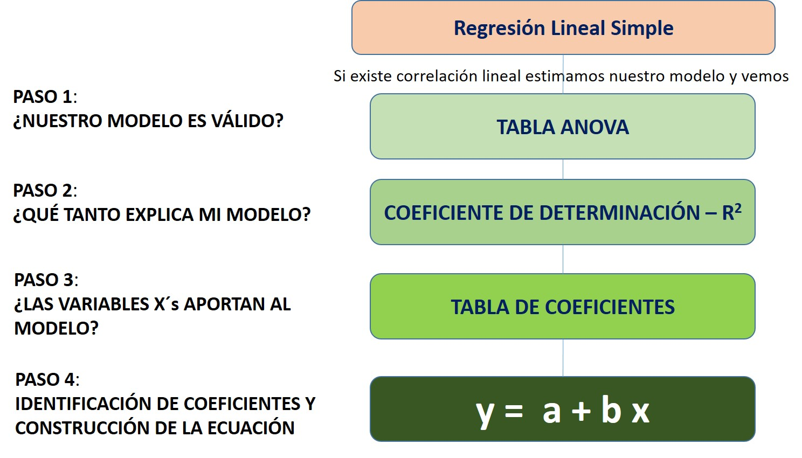
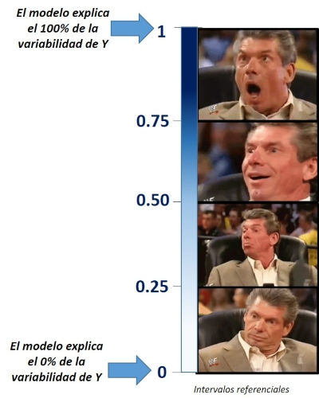

# Regresión Lineal

## Regresión Lineal Simple

Te sugiero revisar el siguiente tutorial para el cálculo de un modelo de regresión simple en :

<iframe width="560" height="315" src="https://www.youtube.com/embed/-p02G7NXlSk" frameborder="0" allow="accelerometer; autoplay; encrypted-media; gyroscope; picture-in-picture" allowfullscreen></iframe>

### Preparación

    library(rio)
    base_trabajadores="https://github.com/DataPolitica/salidas/raw/master/Data/trabajadores.sav"
    trabajadores=import(base_trabajadores)
    attach(trabajadores)

    names(trabajadores)

    ##  [1] "id"              "sexo"            "fechnac"         "educ"           
    ##  [5] "catlab"          "salario_actual"  "salario_inicial" "antiguedad"     
    ##  [9] "experiencia"     "minoría"         "directivo"

**Solicitamos un diagrama de dispersión**

En este caso vamos a seleccionar las dos variables (el salario inicial y salario final) y solicitar un diagrama de dispersión. 

    plot(salario_actual~salario_inicial)
    


Como vemos en el diagrama, podemos ver una línea fácilmente. Ello es un buen indicio de que ambas variables están correlacionadas linealmente; sin embargo, es necesario realizar el test estadístico de correlación para poder tener una mirada más fina. 

**Solicitamos el test de correlación**

Para realizar el test de correlación necesitamos utilizar la función `cor.test`. Colocamos las variables de interés entre el paréntesis separado por una coma y lo solitiamos. 

    cor.test(salario_actual,salario_inicial)

    ## 
    ##  Pearson's product-moment correlation
    ## 
    ## data:  salario_actual and salario_inicial
    ## t = 40.276, df = 472, p-value < 2.2e-16
    ## alternative hypothesis: true correlation is not equal to 0
    ## 95 percent confidence interval:
    ##  0.8580696 0.8989267
    ## sample estimates:
    ##       cor 
    ## 0.8801175

**En este caso hemos solicitado el R de Pearson como el test de correlación. Sin embargo, si la variable no posee una distribución normal sería más adecuado aplicar el Test de Spearman (método no paramétrico).**

### Cálculo

Para calcular un modelo de regresión debemos utilizar la función `lm()`. Dentro de los paréntesis colocamos las variables de la siguiente manera: variable_dependiente ~ variable_independiente. Al modelo le vamos a llamar *modelo1*:

    modelo1=lm(salario_actual~salario_inicial,data=trabajadores)

Luego de ello, podemos darnos cuenta que en nuestra sección de objetos (cuadrante superior derecho) ya figura el modelo1. Para solicitar los resultados colocamos la función `summary(modelo1)`

    summary(modelo1)

    ## 
    ## Call:
    ## lm(formula = salario_actual ~ salario_inicial, data = trabajadores)
    ## 
    ## Residuals:
    ##    Min     1Q Median     3Q    Max 
    ## -35424  -4031  -1154   2584  49293 
    ## 
    ## Coefficients:
    ##                  Estimate Std. Error t value Pr(>|t|)    
    ## (Intercept)     1.928e+03  8.887e+02    2.17   0.0305 *  
    ## salario_inicial 1.909e+00  4.741e-02   40.28   <2e-16 ***
    ## ---
    ## Signif. codes:  0 '***' 0.001 '**' 0.01 '*' 0.05 '.' 0.1 ' ' 1
    ## 
    ## Residual standard error: 8115 on 472 degrees of freedom
    ## Multiple R-squared:  0.7746, Adjusted R-squared:  0.7741 
    ## F-statistic:  1622 on 1 and 472 DF,  p-value: < 2.2e-16

Luego de ello seguimos los pasos de nuestro flujograma:




### Análisis

#### Comprobar si nuestro modelo es válido

Para ello, necesitamos ver la tabla ANOVA, vale decir, las últimas líneas de nuestro output del *modelo1*. 

Recordemos que estamos realizando una prueba de hipótesis, en la cual nuestras hipótesis son las siguientes:

| Hipótesis nula (H0)  | Hipótesis alterna (Ha) |
| ------------- | ------------- |
| El modelo no es válido  | El modelo es válido  |

Entonces leemos el p-valor. Como en este caso obtuvimos un p valor de <2.2e-16 entonces podemos ver que es menor a 0.05 (alpha), rechazamos la hipótesis nula y concluimos que **nuestro modelo es válido**.

#### Capacidad explicativa del modelo

Para ello, debemos ver el valor del R2 ajustado. En este caso lo interpretamos de la siguiente manera:



En este caso, al tener un R2 ajustado de 0.7741 podemos concluir que nuestro modelo explica el 77.41% de la variabilidad de la dependiente (en este caso, salario actual)

#### Verificar si la variable X aporta al modelo

El siguiente paso, luego de ver si nuestro modelo es válido y su capacidad explicativa, debemos ver si efectivamente nuestra variable explicativa aporta al modelo. Para ello, debemos visualizar nuestra tabla de coeficientes y analizar la línea que corresponde a la variable de nuestro interés. 

| Hipótesis nula (H0)  | Hipótesis alterna (Ha) |
| ------------- | ------------- |
| La variable X no aporta al modelo  | La variable X aporta al modelo  |

En este caso, el pvalor de *salario_inicial* nos salió <2e-16 ***. Por ello, al ser menor que 0.05, rechazamos nuestra hipótesis nula (la variable no aporta al modelo) y concluimos que efectívamente sí aporta al modelo de regresión lineal simple. 

Nótese que el pvalor ha venido acompañado de los tres asteriscos o estrellas. Ello indica que el grado de significancia es muy alto. 

#### Identificando los coeficientes y construyendo la ecuación

Para ello, debemos ver nuevamente la tabla de coeficiente, la línea que corresponde a nuestra variable explicativa. En esta tenemos que prestar atención al número que figura en la columna *Estimate*.

No obstante, siempre sugiero solicitar el siguiente código para así evitar errores en la lectura del coeficiente:

    modelo1$coefficients

    ##     (Intercept) salario_inicial 
    ##      1928.20576         1.90945

Con este código le hemos dicho al programa que nos muestre los coeficientes del modelo 1. Por ello, al ser una regresión lineal simple, tenemos dos números: el intercepto y el coeficiente del salario inicial. 

Vemos que el coeficiente del salario inicial es 1.90945, por ello, podemos ver que la relación que existe entre salario inicial y salario actual es directa (al ser positivo el coeficiente).

Finalmente, para construir la ecuación utilizamos los coeficientes que hemos obtenido de la siguiente manera:

salario_actual = 1928.20576 + (1.90945*salario_inicial)

Con esta ecuación del *modelo1*, dado un valor de salario_inicial, nosotros podemos calcular el salario actual de un trabajador. 


## Regresión Lineal Múltiple

Te sugiero ver el siguiente tutorial para realizar un modelo de regresión lineal múltiple.

<iframe width="560" height="315" src="https://www.youtube.com/embed/XtDQD25Ejkc" frameborder="0" allow="accelerometer; autoplay; encrypted-media; gyroscope; picture-in-picture" allowfullscreen></iframe>

### Preparación

**Solicitamos nuestra base de datos desde la nube**

    library(rio)
    base_trabajadores="https://github.com/DataPolitica/salidas/raw/master/Data/trabajadores.sav"
    trabajadores=import(base_trabajadores)
    attach(trabajadores)

    names(trabajadores)

    ##  [1] "id"              "sexo"            "fechnac"         "educ"           
    ##  [5] "catlab"          "salario_actual"  "salario_inicial" "antiguedad"     
    ##  [9] "experiencia"     "minoría"         "directivo"

### Cálculo

Calculamos un modelo de regresión múltiple en el cual tenemos a *salario_actual* como dependiente y contamos con tres independiente o explicativas: el salario inicial del trabajador(*salario_inicial*), los años de educación del trabajador (*educ*) y los años de antiguedad en el cargo (*antiguedad*)

    modelo2=lm(salario_actual~salario_inicial + educ + antiguedad, data=trabajadores)

Luego, solicitamos el resultado utilizando la función `summary`:

    summary(modelo2)

    ## 
    ## Call:
    ## lm(formula = salario_actual ~ salario_inicial + educ + antiguedad, 
    ##     data = trabajadores)
    ## 
    ## Residuals:
    ##    Min     1Q Median     3Q    Max 
    ## -30325  -4231   -658   2924  46707 
    ## 
    ## Coefficients:
    ##                   Estimate Std. Error t value Pr(>|t|)    
    ## (Intercept)     -1.999e+04  3.237e+03  -6.175 1.43e-09 ***
    ## salario_inicial  1.689e+00  5.783e-02  29.209  < 2e-16 ***
    ## educ             9.661e+02  1.579e+02   6.118 2.00e-09 ***
    ## antiguedad       1.557e+02  3.506e+01   4.442 1.11e-05 ***
    ## ---
    ## Signif. codes:  0 '***' 0.001 '**' 0.01 '*' 0.05 '.' 0.1 ' ' 1
    ## 
    ## Residual standard error: 7646 on 470 degrees of freedom
    ## Multiple R-squared:  0.8008, Adjusted R-squared:  0.7995 
    ## F-statistic: 629.7 on 3 and 470 DF,  p-value: < 2.2e-16

Una vez tengamos nuestro resultado seguimos nuevamente los pasos de nuestro flujograma:

### Análisis

#### Comprobar si nuestro modelo es válido

Vemos la tabla ANOVA, vale decir, las últimas líneas de nuestro output del *modelo2*. 

| Hipótesis nula (H0)  | Hipótesis alterna (Ha) |
| ------------- | ------------- |
| El modelo no es válido  | El modelo es válido  |

Entonces leemos el p-valor. Como en este caso obtuvimos un p valor de <2.2e-16 entonces podemos ver que es menor a 0.05 (alpha), rechazamos la hipótesis nula y concluimos que **nuestro modelo es válido**.

####  Capacidad explicativa del modelo

Para ello, debemos ver el valor del R2 ajustado. En este caso lo interpretamos de la siguiente manera:


En este caso, al tener un R2 ajustado de 0.7995 podemos concluir que nuestro modelo de regresión múltiple explica el 79.95% de la variabilidad de la dependiente (en este caso, salario actual).

#### Verificar si las variables X´s aporta al modelo

Ahora que estamos considerando más de una variable, debemos verificar si efectivamente las tres variables explicativas aportan al modelo. 

Para ello, debemos visualizar nuevamente nuestra tabla de coeficientes y analizar la línea que corresponde a la variable de nuestro interés. 

| Hipótesis nula (H0)  | Hipótesis alterna (Ha) |
| ------------- | ------------- |
| La variable X no aporta al modelo  | La variable X aporta al modelo  |

En este caso, el pvalor de *salario_inicial* nos salió <2e-16*** ; el de *educ* salió 2.00e-09*** ; y el de *antiguedad* salió  1.11e-05***.

Por ello, podemos rechazar la hipótesis nula (la variable no aporta al modelo) en los tres casos y concluir que todas las variables aportan al modelo de regresión lineal múltiple. 
  
Nótese que todos los p-valor han venido acompañado de los tres asteriscos o estrellas. Ello indica que el grado de significancia es muy alto es las tres variables explicativas. 

#### Identificando los coeficientes y construyendo la ecuación

Por último, solicitamos los coeficiente de nuestro modelo:

    modelo2$coefficients

    ##     (Intercept) salario_inicial            educ      antiguedad 
    ##    -19986.50217         1.68916       966.10701       155.70118

Con este código le hemos dicho al programa que nos muestre los coeficientes del modelo 2. En esta ocasión, al ser una regresión lineal múltiple, tenemos cuatro número: el intercepto y el coeficiente del salario_inicial, educ y antiguedad. Sobre los coeficiente podemos ver que:

Coeficiente del salario inicial es 1.90945. Es positivo, por ello, podemos ver que la relación es directa (mientras uno aumenta el otro aumenta).

Coeficiente de educ es 9.66.10701. Es positivo, la relación es directa.

Coeficiente de antiguedad es 155.70118. Es positivo, la relación es directa. 

Finalmente, para construir la ecuación utilizamos los coeficientes que hemos obtenido de la siguiente manera:

salario_actual = -19986.50217 + (1.68916*salario_inicial) + (966.10701*educ) + (155.70118*antiguedad)

Con esta ecuación del *modelo2*, dado un valor de salario_inicial, años de educación y años de antiguedad, nosotros podemos calcular el salario actual de un trabajador. 


## Verificación de supuestos

**Obtenemos nuestra base de datos**

```{r}
library(rio)
competitividad=import("https://github.com/ChristianChiroqueR/banco_de_datos/raw/main/DATA_Peru/COVID%20-%20COMPETITIVIDAD.sav")
names(competitividad)
```

**Calculamos un modelo**

Planteemos un modelo en el que deseamos predecir los casos de Covid-19 por cada 100 mil habitantes en las regiones. Para ello, vamos a utilizar las siguientes variables:

Variable dependiente: Casos COVID-19 por cada 100 mil personas 
Variables independientes: Stock de capital por trabajador (var3)  + gasto real por hogar mensual (var5) + morbilidad (var20).

```{r}
modelo1 <- lm(competitividad$casos_100k~ competitividad$var3+competitividad$var5+
                competitividad$var20)
summary(modelo1)
```

**Una vez calculado nuestro modelo pasamos a la verificaciòn de los supuestos**


### Linealidad

**Descrición**

La linealidad indica que el valor esperado de la variable dependiente es una función lineal de cada variable independiente, manteniendo las demás fijas.
La pendiente de esa línea no depende de los valores de las otras variables.
Los efectos de diferentes variables independientes sobre el valor esperado de la variable dependiente son aditivos.

**Cómo detectarlo**

OPCIÓN 1: Exploración gráfica: Plot de valores residuales frente a valores predichos.

OPCIÓN 2: Calculando la correlación bivariada de cada independiente con la dependiente. 

**Código e interpretación**

```{r}
plot(modelo1,1)
```

Los puntos deben distribuirse alrededor de una línea horizontal, con una varianza aproximadamente constante. 
Busque con atención la evidencia de un patrón, lo que indica que el modelo comete errores sistemáticos siempre que hace predicciones inusualmente grandes o pequeñas.


Si usamos la correlación, entonces:

```{r}
cor.test(competitividad$casos_100k, competitividad$var3)
cor.test(competitividad$casos_100k, competitividad$var5)
cor.test(competitividad$casos_100k, competitividad$var20)
```

también lo puedes graficar para que te de una idea de forma más rápida:

```{r}
#install.packages("corrplot")
library(corrplot)
#La funci?n cor calcula la matriz de correlaciones
M<-cor(competitividad[,c(3,11,13,28)],method="pearson")
corrplot(M, method="circle",type="upper")
corrplot(M, method="number")
corrplot.mixed(M)
```


### Normalidad de residuos

**Descrición** 

Identificar si los errores siguen una distribución normal. 

**Cómo detectarlo**

Exploración gráfica: QQ plot de residuos
Pruebas de normalidad a los residuos. Normalmente bastaría con la prueba de Shapiro Wilk, pero también se pueden probar otros como Lillieford, Kolmogorov (no es muy exigente), entre otros. 

**Código e interpretación**

Si usamos sólo gráfico
```{r}
plot(modelo1, 2)
```

Todos los puntos deben estar sobre la diagonal.

Si usamos prueba de normalidad

```{r}
shapiro.test(modelo1$resid)
```

H0: Es normal | Ha: No es normal

Si el pvalor es menor a 0.05 entonces no existe normalidad de residuos (problema!).

### Homocedasticidad

**Descrición** 

La homocedasticidad indica que las variancias de los errores son constantes. 
Cuando no se cumple es un problema porque los estimadores no son consistentes ni eficientes.

**Cómo detectarlo**

OPCIÓN 1: Exploración gráfica: diagrama de residuos standarizados y valores predichos.

OPCIÓN 2: Con el Score Test for Non-Constant Error Variance, también llamado  Test Breusch Pagan. Evalúa si la varianza del error cambia con el nivel de la variable respuesta (valores ajustados) o con una combinación lineal de predictores.

**Código e interpretación**

Si usamos el gráfico

```{r}
plot(modelo1, 3)
```

En el Gráfico la línea roja debe seguir una tendencia horizontal. 

Si usamos el BP:

```{r message=FALSE, warning=FALSE}
library(lmtest)
bptest(modelo1)
```

H0: El modelo es homocedástico
Ha: El modelo es heterocedástico

Si el pvalor es menor a 0.05 entonces el modelo es heterocedástico (problema!).

### Ausencia de multicolinealidad

**Descripción**

Se aplica en la regresión lineal MÚLTIPLE. Significa que las variables explicativas están relacionadas linealmente entre sí. La multicolinealidad hace que los coeficientes del modelo se vuelvan inestables, es decir, oscilarán violentamente ante cambios mínimos en las variables de insumo. 

**Cómo detectarlo**

Con el Factor de Inflación de Varianza (VIF).

**Código e interpretación**

```{r}
library(DescTools)
VIF(modelo1)
```

Valores > 5 indican presencia de multicolinealidad.

### Independencia de residuos

**Descripción**

Si los errores residuales **no son independientes**, es probable que demuestren algún tipo de patrón (que no siempre es obvio a simple vista). 

**Cómo detectarlo**

Se puede realizar el Test de Durbin Watson (que mide el grado de correlación de cada error residual con el error residual "anterior")

**Código e interpretación**

```{r message=FALSE, warning=FALSE}
#Default
library(car)
durbinWatsonTest(modelo1)
```

Durbin Watson: Las hipótesis son:
H0: Los residuos son independientes
Ha: Los residuos no son independientes
Si el pvalor es menor a 0.05 entonces los residuos no son independientes o también se podría decir que están **autocorrelacionados** (problema!)