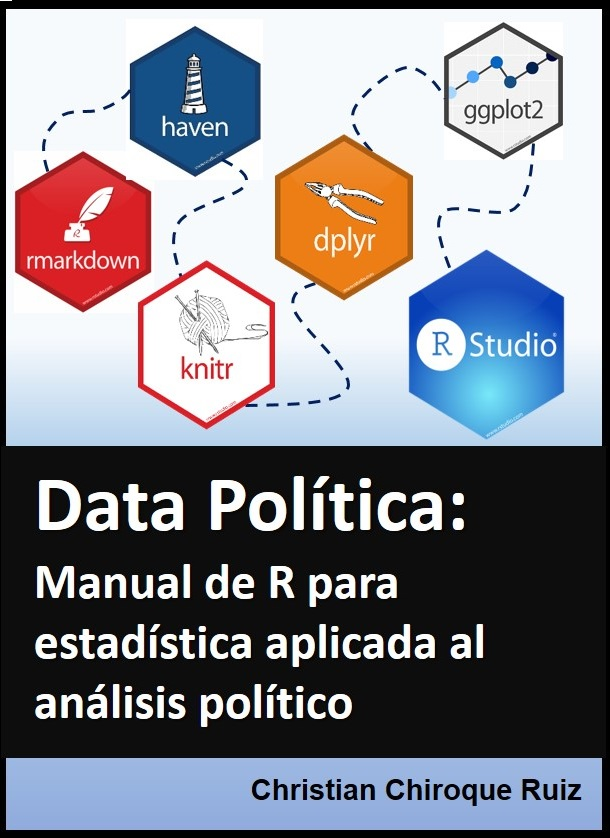

--- 
title: "Manual de R Studio para ciencias sociales"
author: "Christian Chiroque"
date: "`r Sys.Date()`"
site: bookdown::bookdown_site
---

# Presentación { - }

Este `libro` tiene como objetivo ser un soporte para el aprendizaje del software R, a  través del IDE R Studio, y está especialmente dirigido para aquellos estudiantes de ciencias sociales, en general, y ciencia política, en particular. 

Lo más resaltante de este manual:

* **Presenta de una manera fácil, ordenada y práctica los principales temas en estadística aplicada**
* **Incorpora material audiovisual al proceso de aprendizaje de estadística en ciencias sociales (videos del canal de Youtube Data Política, creado por el autor de este manual)**
* **No pretende ser un libro teórico, sino una práctico. Se hará referencia a la teoría en la medida que ayude a tener una idea más clara de lo que se está trabajando en el programa, sin embargo, no es su finalidad principal.**

El presente manual fue una iniciativa personal en el marco de mi labor docente en la Facultad de Ciencias Sociales de la Pontificia Universidad Católica del Perú (cursos Estadística para el Análisis Política 1 y 2). 

Para la construcción de este libro se utilizaron 1) los paquetes de `Bookdown` y `RMarkdown` de R Studio; 2) y el programa Git y la plataforma Github para el control de versiones y Github Pages. 

## Sobre el autor

Christian Chiroque Ruiz. Politólogo con maestría en Gerencia Social por la Pontificia Universidad Católica del Perú PUCP y especialista en Estadística Aplicada por la Escuela Nacional de Estadística e Informática ENEI. Estudiante de la Maestría de Estadística Aplicada de la Universidad Nacional Agraria La Molina. 

Se desempeña como especialista en gestión social para proyectos de inversión y es docente en la Facultad de Ciencias Sociales de la PUCP.

Es creador de Data Política (canal de youtube para la difusión de estadística aplicada) y cofundador de Leyendo el Poder (grupo de debate de teorías de ciencia política y estudios internacionales).

## Sugerencia de citado

Chiroque, Christian (2020) *Manual de R Studio para ciencias sociales*. Data Política: Lima

